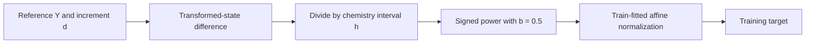

# GBCT source check and matched target adaptation

Source check: 2026-10-09. This note records a source inspection, not a reproduced
paper result. For canonical method names and diagrams, use the
[method catalogue](../research-method-catalogue.md). For scoring definitions,
use the [dual-scaling protocol](representation-accuracy-success-sources.md#required-dual-scaling-protocol-for-later-runs).

## Decision

Add a **GBCT target adaptation** to the controlled representation experiment.
Keep its identity separate from direct signed-power increments and from a full
GBCTNet reproduction. Keep our data, split, network, precision, optimizer budget,
and train-only normalization fixed across paired target comparisons. Test
coordinate, increment-scaled physical, and state-scaled physical objectives as
separate factors. Evaluate every model under both physical scoring rules.

## Primary sources

- Yi, Wang, Zhang and Xu, *An output scaling layer boosts deep neural networks
  for multiscale ODE systems*, [arXiv:2512.05685v1](https://arxiv.org/html/2512.05685v1).
- Author repository: [Seauagain/GBCT](https://github.com/Seauagain/GBCT), inspected
  at commit `982e58954af5c5e8e3860d3057363b83bcbaeac6`.
- [CLI defaults](https://github.com/Seauagain/GBCT/blob/982e58954af5c5e8e3860d3057363b83bcbaeac6/deepode/nn/config.py).
- [Transform primitives](https://github.com/Seauagain/GBCT/blob/982e58954af5c5e8e3860d3057363b83bcbaeac6/deepode/nn/data_processor.py).
- [Chemical data loader](https://github.com/Seauagain/GBCT/blob/982e58954af5c5e8e3860d3057363b83bcbaeac6/deepode/nn/dataloader.py).
- [Inference](https://github.com/Seauagain/GBCT/blob/982e58954af5c5e8e3860d3057363b83bcbaeac6/deepode/nn/predictor.py#L188-L256).

## What the target means

Let `Y` be the starting mass fraction, `d` the reference physical increment, and
`h > 0` the chemistry interval. The target is

\[
B_a(y)=\frac{y^a-1}{a},\qquad
q=\frac{B_a(Y+d)-B_a(Y)}{h},\qquad
z=G_b(q)=\frac{\operatorname{sgn}(q)|q|^b}{b}.
\]

The paper uses `a = 0.1` and `b = 0.5` in its benchmarks. The chemical time
interval is `1e-6 s`. GBCT acts on the **change rate in transformed-state
coordinates**, not directly on `d` or `d/h`. BCTNet predicts `q`; GBCTNet predicts
`G_b(q)`. The paper uses matching networks with hidden widths 1600, 800 and 400,
GELU, Adam and L1 loss. Its two training stages each contain 2500 epochs.
[Paper, Sections 3 and 5](https://arxiv.org/html/2512.05685v1#S3)

At inference, undo affine normalization, apply
`q_hat = sign(z_hat) * (b * abs(z_hat))**(1/b)`, multiply by `h`, add `B_a(Y)`,
and apply the BCT inverse. The code implements this order. For a single input
state, its predictor also uses Cantera enthalpy conservation to correct
temperature. Do not silently import that correction into our fixed-temperature
chemistry task.
[Author inference](https://github.com/Seauagain/GBCT/blob/982e58954af5c5e8e3860d3057363b83bcbaeac6/deepode/nn/predictor.py#L188-L256)

## Released-code details and differences from the paper

The CLI defaults are `power_transform=0.1`, `lam=0.5`, and `delta_t=1e-6`.
GBCT is disabled unless `--use_GBCT` (or its alias) is supplied. Default training
uses float-network conventions, L1 loss, Adam and a learning rate of `1e-4`.
The default hidden widths match the paper.
[Configuration](https://github.com/Seauagain/GBCT/blob/982e58954af5c5e8e3860d3057363b83bcbaeac6/deepode/nn/config.py)

The loader transforms species columns at both endpoints, then differences and
divides by `delta_t`. Temperature and pressure are not BCT-transformed; their
change rates are included in the released label array before optional GBCT.
It normalizes inputs by sample standard deviation (`ddof=1`, epsilon zero).
Labels are centered and divided by **mean absolute uncentered transformed
label**, plus `1e-20`. The saved name `label_std` therefore does not imply a
standard deviation. `__getitem__` explicitly converts inputs and labels to
`torch.float32`. Normalization occurs before the random training/validation
split. Our adaptation must fit statistics on training rows only.
[Loader](https://github.com/Seauagain/GBCT/blob/982e58954af5c5e8e3860d3057363b83bcbaeac6/deepode/nn/dataloader.py)

This is a source discrepancy: Section 3.2 of the paper states Z-score
normalization for both inputs and labels; the released chemical loader uses the
mean-absolute label scale above. The paper describes species-only prediction
with thermodynamic recovery, while the released loader includes `T` and `P`
label columns. Record the selected convention; do not claim these are identical.
[Paper](https://arxiv.org/html/2512.05685v1#S3.SS2)
[Loader](https://github.com/Seauagain/GBCT/blob/982e58954af5c5e8e3860d3057363b83bcbaeac6/deepode/nn/dataloader.py)

The transform primitives have no concentration offset, no clipping floor, and
no inverse-domain guard. For positive exponents, zero maps to `B_a(0)=-1/a`
and `G_b(0)=0`. The implementation substitutes sign one at exactly zero before
multiplication by the zero power; the result is still zero. Although the paper
defines a logarithmic branch for `a=0`, this code directly divides by `a` and
does not implement that branch.
[Primitives](https://github.com/Seauagain/GBCT/blob/982e58954af5c5e8e3860d3057363b83bcbaeac6/deepode/nn/data_processor.py)

## Numerical safeguards for our adaptation

The following are algebraic deductions and proposed safeguards, not claims of
extra safeguards in the author implementation.

1. Use the existing trustworthy increment `d` to form the transformed-state
   difference. Where `Y > 0` and `Y+d > 0`, use

   \[
   B_a(Y+d)-B_a(Y)
   =\frac{Y^a}{a}\operatorname{expm1}
      \left[a\operatorname{log1p}(d/Y)\right].
   \]

   Handle `Y=0` and `Y+d=0` explicitly. A stable transform cannot restore an
   increment lost earlier in reference generation.

2. Check the inverse domain **before** exponentiation:

   \[
   v=Y^a+a h\widehat q\geq0.
   \]

   A negative `v` is not a valid nonnegative-state BCT inverse. With `a=0.1`,
   blindly raising a negative value to the integer power 10 can return a
   positive number on the wrong branch. Count invalid predictions; never
   silently convert them into accepted states by clipping.

3. Where `Y>0` and the inverse is valid, reconstruct the increment with

   \[
   \widehat d=Y\operatorname{expm1}
   \left[\frac{1}{a}\operatorname{log1p}
   \left(\frac{a h\widehat q}{Y^a}\right)\right].
   \]

   Use explicit endpoint branches and finite-value checks. This avoids a final
   subtraction of nearly equal reconstructed states.

4. Test both signs, zero, depletion to zero, trace concentrations, domain
   violations, and FP32/FP64 round trips. Record dtype separately from target
   family. The original FP32 loader is not evidence of FP64 label precision.

5. Preserve `h` in the target definition and artifact metadata. For a single
   fixed `h`, homogeneity gives `G_b(c/h)=h**(-b) G_b(c)`; a fitted affine scale
   can largely absorb this constant. For varying `h`, it is not one global
   constant and must not be dropped.

## What this experiment can establish

The bounded experiment can test whether this **target composition** improves
physical increment or state-budget acceptance in our declared domain. Use
identical rows, input preparation, seeds and compute limits for the comparison.
Preserve all earlier scoring curves and include a zero-update control.

This does not reproduce the published DRM19 dataset, network size, full training
schedule, trajectory tests, or thermodynamic correction. A different result on
our ammonia/methane task would not, by itself, confirm or refute the paper.
The current reused holdout remains development data; no independent-test claim
is permitted without a separately frozen test protocol.
