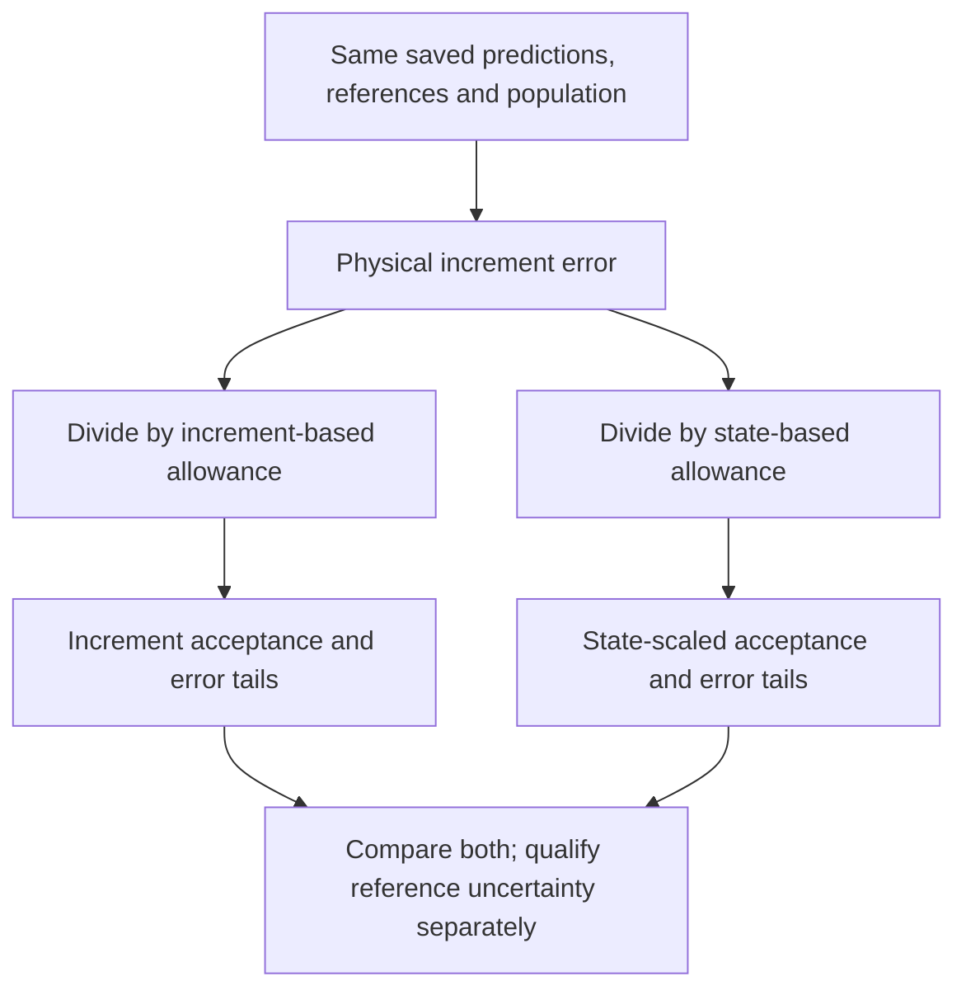

# Representation accuracy: source check and proposed measures

Checked 2026-10-09. The dual-scaling protocol below is required for later runs.
This documentation update does not change saved scores or start an experiment.

## Paper facts

Ke Xiao et al. report approximately 1.25 million original flame states and
8 million filtered, perturbed training states. Their pressure augmentation is

\[
p'=p+0.15[\max(p)-\min(p)]X,\qquad X\sim U[-1,1].
\]

This is 15% of the sampled pressure **span**, not 15% of pressure. They also
interpolate flame states and perturb temperature and composition.
[Sections 2.2–2.3](https://arxiv.org/html/2507.08277v2#S2.SS3)

The Small-Scale Prediction Index uses threshold \(\tau=10^{-15}\):

\[
\operatorname{SSPI}(\tau)=
\frac{\#\{i:|d_i|<\tau\ \land\ |\hat d_i|<\tau\}}
{\#\{i:|d_i|<\tau\}}.
\]

Here \(d\) denotes the species-increment target, to avoid confusion with an
endpoint mass fraction. The paper's Equation 8 uses \(Y\) notation. Test SSPI is
0.6900 for BC and 0.9874 for PT. BC has lower overall MAE and RMSE, and a higher
fraction within 1% relative error. Thus the metric changes the ranking.
[Section 3.2, Equation 8 and Table 1](https://arxiv.org/html/2507.08277v2#S3.SS2)

## What SSPI does not establish

The following conclusions follow from the formula, not from a new experiment:

- An always-zero predictor has SSPI 1 whenever the denominator is nonzero.
- Two targets below the threshold can differ greatly in relative terms.
- Two signed values below the threshold can differ by almost \(2\tau\).
- A value just outside the threshold can fail SSPI despite a small absolute error.

Use SSPI to ask, “Does a small true increment produce a small prediction?”
Do not use it alone to claim accurate nonzero increments or numerical-solver
accuracy. Include the zero predictor and report how many targets enter the metric.

## What CVODE tolerances mean

CVODE uses solution-dependent weights
\(W_i=1/(\operatorname{atol}_i+\operatorname{rtol}|y_i|)\) and a weighted
root-mean-square norm. It estimates local integration error and rejects a step
when its error test fails. This is not a guarantee of a specified number of
correct digits in every component or of bounded error over a full trajectory.
An RMS condition also differs from requiring every component to pass.
[SUNDIALS mathematical description, Equation 3.6 and local error test](https://sundials.readthedocs.io/en/latest/cvode/Mathematics_link.html)

Cantera 3.2.0 sets ReactorNet state defaults to `rtol=1e-9`, `atol=1e-15`.
These are integration settings, not automatically suitable neural-network
acceptance criteria.
[Versioned ReactorNet source](https://github.com/Cantera/cantera/blob/v3.2.0/include/cantera/zeroD/ReactorNet.h)

### Parameters, contributions and total allowance

In the standard formula, `epsilon_i = atol_i + rtol * abs(y_i)`:

| Term | Meaning | Standard behavior |
| --- | --- | --- |
| `atol_i` | Absolute-tolerance parameter, in the units of component i | Fixed scalar or component-specific value |
| `rtol` | Relative-tolerance parameter, dimensionless | Fixed scalar |
| `rtol * abs(y_i)` | Relative-error contribution in physical units | Changes with state magnitude |
| `epsilon_i` | Total allowed-error scale, not machine epsilon | Changes even when both parameters stay fixed |

The standard scalar/vector tolerance interfaces do not automatically make the
parameters functions of magnitude. CVODE also permits user-defined error
weights; this is separate from its standard formula.
[CVODE tolerance interfaces](https://sundials.readthedocs.io/en/latest/cvode/Usage/index.html)

A custom policy `tau_i(m) = a_i(m) + r_i(m)*m` may vary **both** terms with
magnitude. This is a separate research factor, not a description of standard
CVODE behavior. Once both terms vary, their decomposition is not unique; record
the total allowed-error curve, its units, zero behavior and applicable domain.
Such a curve is not yet selected or tested. Earlier suggestions of fixed species
floors were proposals, not a requirement that `a_i(m)` must remain constant.

## Required dual-scaling protocol for later runs

Implementation: [GBCT and paired error-scale experiment](../../benchmarks/offline_accuracy/paired/README.md).
Its GPU campaign keeps both policy IDs below and preserves historical scores.
Custom magnitude-dependent parameters remain a separate untested factor.

Approved direction: evaluate both state-based and increment-based scaling in
later offline runs. The definitions below are project choices inspired by solver
error control, not requirements from CVODE or the Fuel paper. No new results for
this paired comparison are claimed here.

Separate the research question about increments from the application question
about the state after one chemistry interval. For reference increment \(d_i\),
prediction \(\hat d_i\), and reference endpoint \(Y_i^+\), report both:

\[
E_i^{\Delta}=
\frac{|\hat d_i-d_i|}{a_i^{\Delta}+r^{\Delta}|d_i|},\qquad
E_i^{Y}=
\frac{|\hat d_i-d_i|}{a_i^Y+r^Y|Y_i^+|}.
\]

The first measures increment accuracy. The second measures state error from
the same initial state, before any additional endpoint-rounding error. It is
inspired by solver weights but is not CVODE's internal local-error estimator.
For each selected contract, a component passes when \(E_i\leq1\).

Use names `increment-reference-v1` and `state-endpoint-v1`. In the latter,
`Y_i^+ = Y_i + d_i` is the reference endpoint, never the predicted endpoint.
A scale based on `max(abs(Y_i), abs(Y_i^+))` is a possible alternative, but must
have a separate name; do not mix it with the endpoint convention above.

The numerator is the same physical increment error in both metrics. A tiny
increment in a large species concentration can pass the state-based rule while
failing the increment-based rule. This is a difference in the question asked,
not contradictory evidence. Compute the error from saved signed increments;
forming two rounded endpoints first can hide small errors through cancellation.

### Later-run checklist

1. Freeze a numerical tolerance grid and policy IDs before the next test. Keep
   the historical increment benchmark `atol=1e-15, rtol=0.1` unchanged. Include a
   paired grid with identical parameters under both magnitude definitions to
   isolate the effect of the scale. Label any additional application-specific
   state budget separately; equal parameters do not imply equal physical demands.
2. First evaluate the same frozen predictions with both scales. Report training,
   development and fresh independent-case test separately. Do not resplit or
   consume new test data just to add this diagnostic.
3. Then compare training with state-scaled versus increment-scaled physical
   objectives. Keep data, split, architecture, target representation, seed,
   optimizer and work budget matched. Evaluate **each** resulting model with
   **both** metrics. Changing the scoring rule alone is not a learning gain.
4. Treat a new target encoding or magnitude-dependent `a_i(m), r_i(m)` curve as
   a separate ablation. A label-dependent scale may be used in training loss
   and offline evaluation, but must not be required by an inference-time decoder.
5. For each policy, report component and all-58-species state acceptance, p50,
   p95, p99 and maximum normalized errors, species/magnitude bins, the zero
   control, negative states, conservation and measured computational cost.
   Add a weighted RMS summary only under its own name, not as a replacement for
   the all-component pass rule.
6. Qualify reference uncertainty separately under each budget and report
   qualified coverage. Unknown is not zero error. A subset audit cannot certify
   the full population. Preserve earlier labels, predictions and reports.

The paired training/evaluation layout is:

| Training objective | Increment-scaled evaluation | State-scaled evaluation |
| --- | --- | --- |
| Existing coordinate-loss control | Required | Required |
| Increment-scaled physical loss | Required | Required |
| State-scaled physical loss | Required | Required |

This separates learning improvements from changes in what the score measures.
Dataset growth remains a separate controlled factor; CFD transfer comes later.

Before training, fix the tolerance pairs, mechanism, chemistry interval,
state distribution, and data split. Report component pass fractions and the
fraction of states where **all** components pass. Also report per-species and
magnitude-bin results, tail errors, cost, and the zero baseline. A weighted RMS
score can be an additional solver-style summary; do not replace the worst
component with it without saying so.

Keep reference uncertainty separate. A convergence difference is an uncertainty
estimate, not a rigorous bound. If a justified bound \(u_i\) is available, an
error budget \(b_i\) supports a conservative pass only when
\(|\hat d_i-d_i^{ref}|+u_i\leq b_i\). Otherwise flag labels whose uncertainty is
too large for the requested test; do not silently count them as accurate zeros.

Use offline chemistry tests for this first decision. CFD transfer and coupled
trajectory tests answer later questions. Broader pressure sampling must use a
declared physical range and fresh labels at the perturbed pressure; it does not
require a CFD test before the representation comparison can proceed.

## Follow-up: saturation and one residual stage

Checked 2026-10-09 against the two specified arXiv versions. This section
proposes an offline experiment; it does not authorize or launch training.

### Findings from the papers

The original MSNN paper fits successive residuals after dividing each by its
training RMS, then adds the scaled predictions. Frequency-aware initialization
and a periodic first layer are separate ingredients: residual normalization
alone does not remove spectral bias. Its noiseless demonstrations approach
double precision, but the discussion explicitly identifies slower convergence
in higher dimensions and difficulty with steep gradients.
[Sections 2.2–2.3 and 5](https://arxiv.org/html/2307.08934v1#S2.SS2)
[Discussion](https://arxiv.org/html/2307.08934v1#S5)

SI-MSNN initializes a Fourier embedding from measured spectral modes,
amplitudes, and phases. In its 2D comparison, third-stage residuals improve
from about `1e-8` to `1e-13` at equal iteration counts. Four stages fit a
2D turbulence stream-function snapshot to about `1e-16`; this is snapshot
regression, not a learned time integrator. The setup uses a regular `512 x 512`
grid, Fourier layers up to 10,000 units, an L10 objective, and a reported
150,000-iteration training setup. These demonstrations do not establish
accuracy for irregular, high-dimensional, 59-species chemistry inputs.
[Methods and experiments](https://arxiv.org/html/2407.17213v1#S3)
[Snapshot experiment](https://arxiv.org/html/2407.17213v1#S4.SS2)

### Proposed chemistry experiment, not a paper result

Comparing 2,000 and 10,000 training rows at a fixed 2,000 optimizer updates
does not establish saturation of the four target representations. Dataset size
and optimization budget are different axes. Continuing improvement at the final
checkpoint argues against an established plateau; lower transformed training
loss with worse held-out physical errors instead calls for objective and
generalization checks. Neither observation proves an optimizer-only cause.

The current `asinh-training-q90` scale is a per-species training statistic,
not a tolerance-derived scale; see
[the training implementation](../../benchmarks/flame_conditioning/train.py).
For an increment budget `b_i = a_i + r * abs(d_i)`, compare signed-log and
asinh targets with crossover `s_i = a_i / r`, keeping `a_i > 0` fixed before
training. Signed-log `sign(d_i) * log1p(abs(d_i) / s_i)` has local sensitivity
proportional to `1 / b_i`; asinh provides a smooth approximation. Transformed
loss is not an exact finite-error acceptance test. Train and evaluate an
explicit physical-error term `abs(pred_i - d_i) / b_i` as a separate ablation.
Any chosen relative tolerance, including 10%, still needs a declared absolute
floor and label-uncertainty check.

First test one frozen-base residual stage with scales fitted only on training
residuals. Declare whether the correction is added in transformed or physical
coordinates; evaluate the reconstructed physical increment in either case.
Keep a common held-out split, seeds, precision, label set, and acceptance
contract. Compare against continued training of the same base for the added
update budget, and a single network with comparable total parameter capacity.
Report wall time and inference cost because equal updates do not imply equal
compute. Separate changes to target scale, physical loss, residual staging,
and spectral features, so their effects remain identifiable.

Use per-species and magnitude-bin results, all-non-argon-species state pass fractions,
tails, and zero baselines. Retain the old state-budget diagnostics with their
original names; they are not evidence of passing a new increment contract.
Treat FFT-based initialization as a later experiment requiring justified input
coordinates and spectral estimation for irregular chemistry samples. A first
normalized residual stage is a useful bounded test, not a reproduction of the
papers' complete machine-precision method.
