# Chemistry method catalogue

> Generated from [the canonical registry](../benchmarks/flame_conditioning/report-content/method-catalogue.mjs). Do not edit this page by hand. Run `node scripts/build_research_method_catalogue.mjs --write` after changing the registry or renderer.

This is the naming and diagram reference for the offline representation study. The [live report](https://xiao312.github.io/DFODE-kit/flame-conditioning/) contains measured results and the split/tolerance review guide. [Issue #3](https://github.com/xiao312/DFODE-kit/issues/3) records decisions. Old comments and artifact IDs remain historical records; use the mappings here to read them.

The [accuracy protocol](agents/representation-accuracy-success-sources.md#required-dual-scaling-protocol-for-later-runs) distinguishes CVODE tolerance parameters, state-based error scaling, increment-based error scaling and custom magnitude-dependent budgets. Later runs must compare both error scales; the existing results are unchanged.

## Three different concepts

1. **Representation:** the coordinate system for a signed physical increment.
2. **Method recipe:** input features, representation, approximator, loss and optimization.
3. **Run:** recipe plus dataset, split, seed, precision and work budget.

Changing a seed does not create a new method. Sharing an asinh transform does not make two recipes identical. The historical `arrhenius-*` IDs mean inverse-temperature and log-partial-pressure features, not an exact Arrhenius law. GBCT, full ISAT and spectrum-informed MSNN are not implemented by these recipes.

## Data split sequence

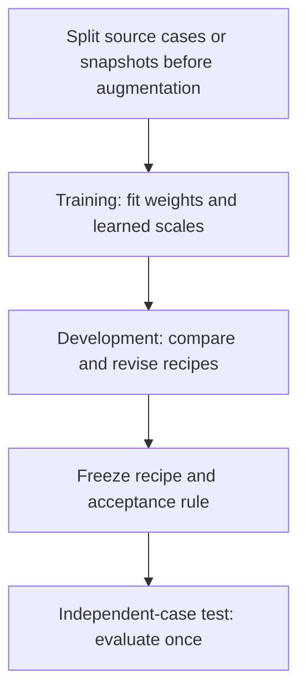

Current campaign: 10,000 selected training states per seed from 10,010 accepted rows; 1,023 development states. Four training and two development snapshots come from one flame realization. Development has been inspected repeatedly. Current independent-test performance is **not evaluated**, not zero. Older CFD test results concern older models. Local-table training scores are resubstitution scores, not leave-one-out validation.

## Representation index

Here d=delta Y, Y is the initial mass fraction, and z is the encoded target before recipe-specific scaling. Encoding uses reference labels during fitting. Inference predicts z from inputs and applies the inverse; it cannot inspect the unknown reference increment.

<a id="representation-state-boxcox"></a>
### Transformed-state increment

Representation ID: `state-boxcox`.

`z = B(Y + d) - B(Y), B(y) = (y^0.1 - 1)/0.1`

Transform the states, then take their coordinate difference. Stable log1p/expm1 algebra avoids avoidable cancellation. Invalid predicted inverse domains are corrected and counted.

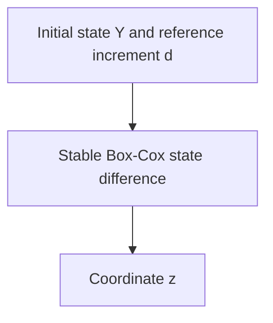

<a id="representation-signed-power"></a>
### Direct signed-power increment

Representation ID: `signed-power`.

`z = sign(d) * abs(d)^0.1 / 0.1`

Transform the signed physical increment directly. This is not the GBCT composition.

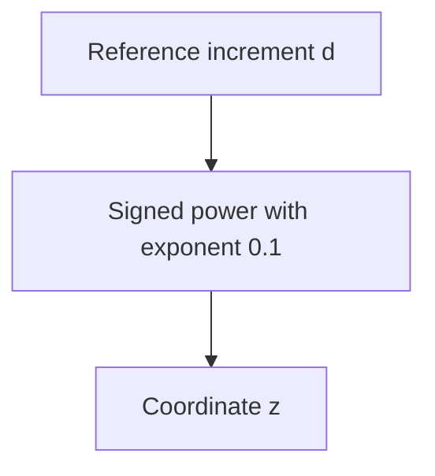

<a id="representation-budget-linear"></a>
### State-budget linear increment

Representation ID: `budget-linear`.

`z = d / (1e-12 + 1e-6 * abs(Y))`

Scale by the initial-state budget. This scale is not the increment-acceptance budget and does not use an unknown future reference at inference.

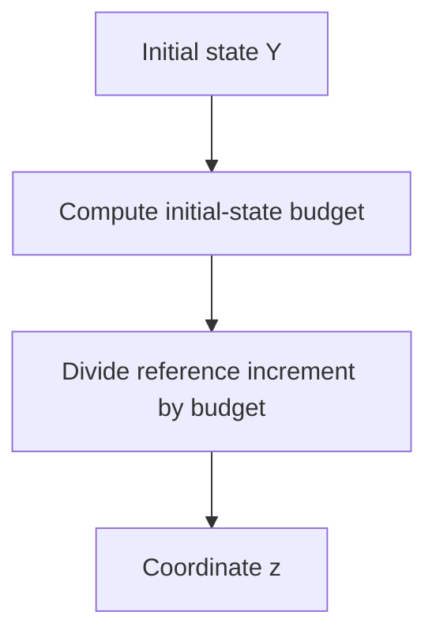

<a id="representation-scaled-asinh"></a>
### Empirical-scale asinh increment

Representation ID: `scaled-asinh`.

`z = asinh(d / s_i)`

Fit species scales s_i on training rows only. The scale is not a test-fitted parameter or a numerical accuracy guarantee.

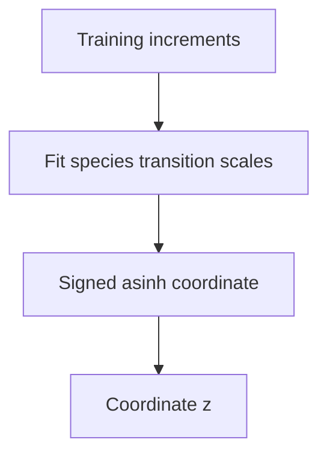

<a id="representation-budget-log"></a>
### Tolerance-scale signed-log increment

Representation ID: `budget-log`.

`z = sign(d) * log1p(r * abs(d) / a) / r`

Use a=1e-15 and r=0.1. The derivative is exactly 1/(a+r*abs(d)); this aligns small coordinate errors locally with the chosen increment budget.

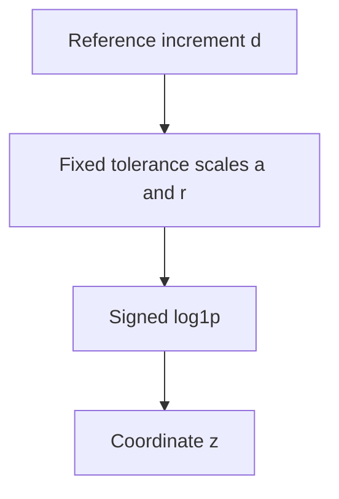

<a id="representation-budget-asinh"></a>
### Tolerance-scale asinh increment

Representation ID: `budget-asinh`.

`z = asinh(r * d / a) / r`

Use a=1e-15 and r=0.1. The derivative is 1/sqrt(a^2+r^2*d^2), not exactly the additive acceptance rule.


## Method index

Click a method name for its steps. Diagrams summarize the recipe, including fitting where labelled; they are not per-query cost diagrams.

| Stable artifact ID | Canonical name | Family |
| --- | --- | --- |
| `original-state-boxcox` | [Transformed-state increment — 2k updates](#original-state-boxcox) | Matched dense networks |
| `long-state-boxcox` | [Transformed-state increment — 4k updates](#long-state-boxcox) | Matched dense networks |
| `original-signed-power` | [Direct signed-power increment — 2k updates](#original-signed-power) | Matched dense networks |
| `long-signed-power` | [Direct signed-power increment — 4k updates](#long-signed-power) | Matched dense networks |
| `original-budget-linear` | [State-budget linear increment — 2k updates](#original-budget-linear) | Matched dense networks |
| `long-budget-linear` | [State-budget linear increment — 4k updates](#long-budget-linear) | Matched dense networks |
| `original-scaled-asinh` | [Empirical-scale asinh increment — 2k updates](#original-scaled-asinh) | Matched dense networks |
| `long-scaled-asinh` | [Empirical-scale asinh increment — 4k updates](#long-scaled-asinh) | Matched dense networks |
| `budget-log` | [Tolerance-scale signed-log increment](#budget-log) | Tolerance-derived targets |
| `physical-budget-log` | [Tolerance-scale signed-log increment + physical loss](#physical-budget-log) | Tolerance-derived targets |
| `budget-asinh` | [Tolerance-scale asinh increment](#budget-asinh) | Tolerance-derived targets |
| `physical-budget-asinh` | [Tolerance-scale asinh increment + physical loss](#physical-budget-asinh) | Tolerance-derived targets |
| `residual-state-boxcox` | [RMS-scaled additive residual](#residual-state-boxcox) | Residual corrections |
| `deep-state-boxcox` | [Transformed-state increment — 8-layer control](#deep-state-boxcox) | Capacity control |
| `continue-coordinate` | [Transformed-state coordinate continuation](#continue-coordinate) | Warm-start loss changes |
| `finetune-physical` | [Transformed-state physical fine-tuning](#finetune-physical) | Warm-start loss changes |
| `finetune-tail` | [Transformed-state tail fine-tuning](#finetune-tail) | Warm-start loss changes |
| `relative-correction` | [Base-relative asinh correction](#relative-correction) | Residual corrections |
| `protected-correction` | [Protected base-relative asinh correction](#protected-correction) | Residual corrections |
| `local-state` | [Local RBF — transformed-state increment](#local-state) | Local tables |
| `local-asinh` | [Local RBF — tolerance-scale asinh](#local-asinh) | Local tables |
| `arrhenius-heads` | [Log-partial-pressure heads — Adam](#arrhenius-heads) | Input and architecture changes |
| `arrhenius-lbfgs` | [Log-partial-pressure heads — L-BFGS/RMS](#arrhenius-lbfgs) | Input and architecture changes |
| `arrhenius-local` | [Log-partial-pressure local RBF](#arrhenius-local) | Input and architecture changes |
| `rate-euler` | [Initial-rate Euler control](#rate-euler) | Non-learned kinetics controls |
| `frozen-exponential` | [Frozen production–destruction control](#frozen-exponential) | Non-learned kinetics controls |

Report aliases: `base` → `long-state-boxcox`.

The zero-increment control always returns zero; it is not fitted.

## Method steps

<a id="original-state-boxcox"></a>
### Transformed-state increment — 2k updates

Artifact ID: `original-state-boxcox`. Family: Matched dense networks.

4x800 GELU, FP32, L1 coordinate loss, Adam, 2,000 updates. Training-only output standardization. State count and seed belong to the run.

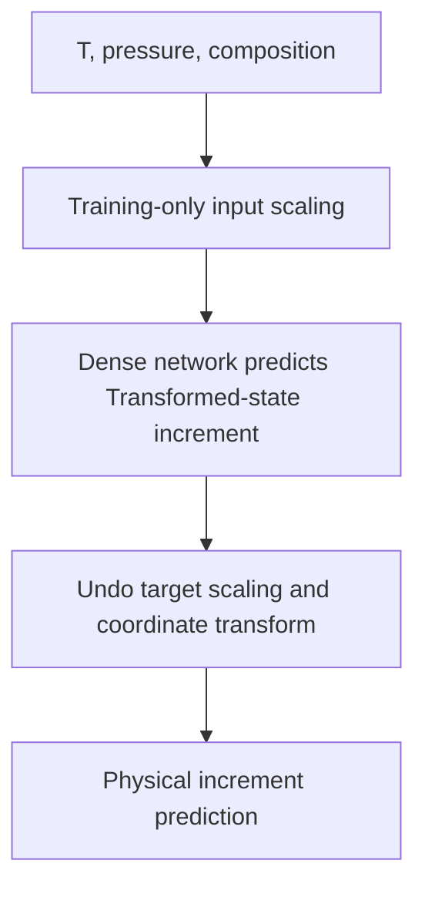

<a id="long-state-boxcox"></a>
### Transformed-state increment — 4k updates

Artifact ID: `long-state-boxcox`. Family: Matched dense networks.

Same 4x800 recipe; fresh 4,000-update cosine schedule from the original initialization, not continued Adam state. 10,000 selected training rows.


<a id="original-signed-power"></a>
### Direct signed-power increment — 2k updates

Artifact ID: `original-signed-power`. Family: Matched dense networks.

4x800 GELU, FP32, L1 coordinate loss, Adam, 2,000 updates. Training-only output standardization. State count and seed belong to the run.

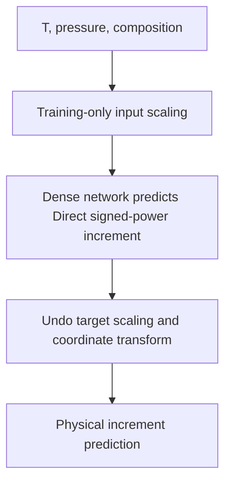

<a id="long-signed-power"></a>
### Direct signed-power increment — 4k updates

Artifact ID: `long-signed-power`. Family: Matched dense networks.

Same 4x800 recipe; fresh 4,000-update cosine schedule from the original initialization, not continued Adam state. 10,000 selected training rows.


<a id="original-budget-linear"></a>
### State-budget linear increment — 2k updates

Artifact ID: `original-budget-linear`. Family: Matched dense networks.

4x800 GELU, FP32, L1 coordinate loss, Adam, 2,000 updates. Training-only output standardization. State count and seed belong to the run.

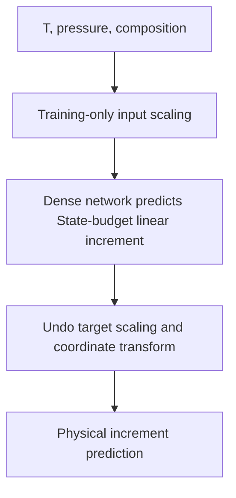

<a id="long-budget-linear"></a>
### State-budget linear increment — 4k updates

Artifact ID: `long-budget-linear`. Family: Matched dense networks.

Same 4x800 recipe; fresh 4,000-update cosine schedule from the original initialization, not continued Adam state. 10,000 selected training rows.


<a id="original-scaled-asinh"></a>
### Empirical-scale asinh increment — 2k updates

Artifact ID: `original-scaled-asinh`. Family: Matched dense networks.

4x800 GELU, FP32, L1 coordinate loss, Adam, 2,000 updates. Training-only output standardization. State count and seed belong to the run.


<a id="long-scaled-asinh"></a>
### Empirical-scale asinh increment — 4k updates

Artifact ID: `long-scaled-asinh`. Family: Matched dense networks.

Same 4x800 recipe; fresh 4,000-update cosine schedule from the original initialization, not continued Adam state. 10,000 selected training rows.


<a id="budget-log"></a>
### Tolerance-scale signed-log increment

Artifact ID: `budget-log`. Family: Tolerance-derived targets.

4x800, 2,000 updates, L1 coordinate loss. Fixed coordinate divisor 100 and zero offset; no species-wise output standardization.

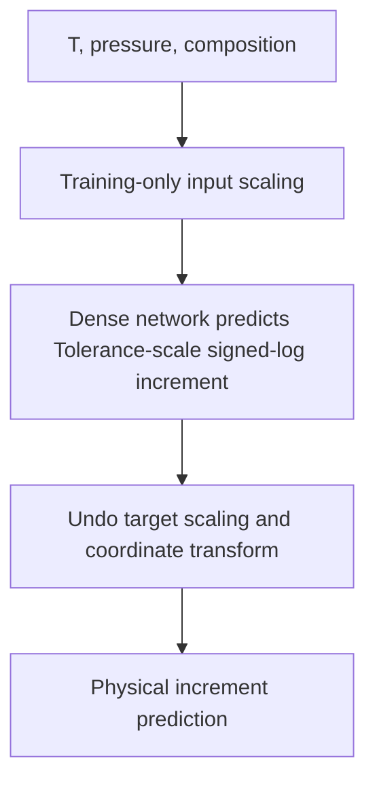

<a id="physical-budget-log"></a>
### Tolerance-scale signed-log increment + physical loss

Artifact ID: `physical-budget-log`. Family: Tolerance-derived targets.

Same recipe plus 0.01 times mean log1p(abs(physical error)/budget). This is a target-and-loss method, not a new representation.


<a id="budget-asinh"></a>
### Tolerance-scale asinh increment

Artifact ID: `budget-asinh`. Family: Tolerance-derived targets.

4x800, 2,000 updates, L1 coordinate loss. Fixed coordinate divisor 100 and zero offset; no species-wise output standardization.

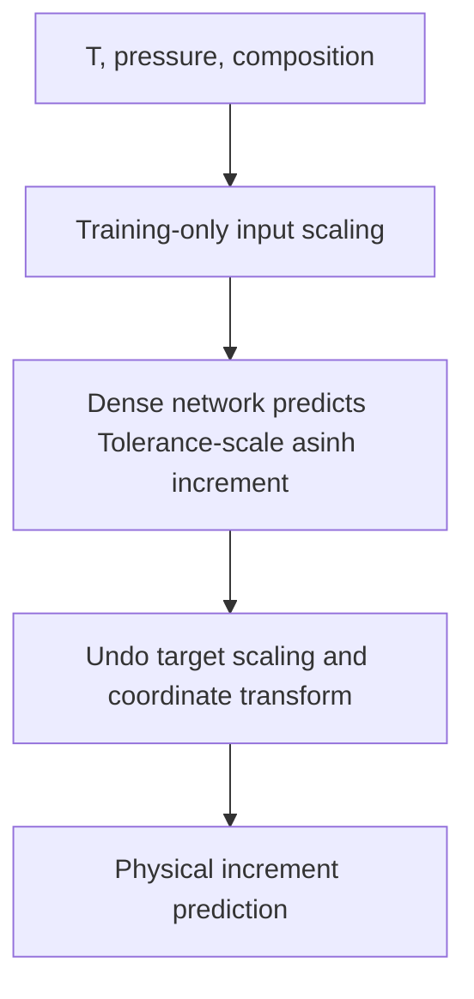

<a id="physical-budget-asinh"></a>
### Tolerance-scale asinh increment + physical loss

Artifact ID: `physical-budget-asinh`. Family: Tolerance-derived targets.

Same recipe plus 0.01 times mean log1p(abs(physical error)/budget). This is a target-and-loss method, not a new representation.


<a id="residual-state-boxcox"></a>
### RMS-scaled additive residual

Artifact ID: `residual-state-boxcox`. Family: Residual corrections.

Freeze the original 2k base. Fit one 4x800 network for 2k updates to FP64 physical residuals, divided by per-species training RMS. Reconstruct and add in FP64. This is not the later base-relative correction.

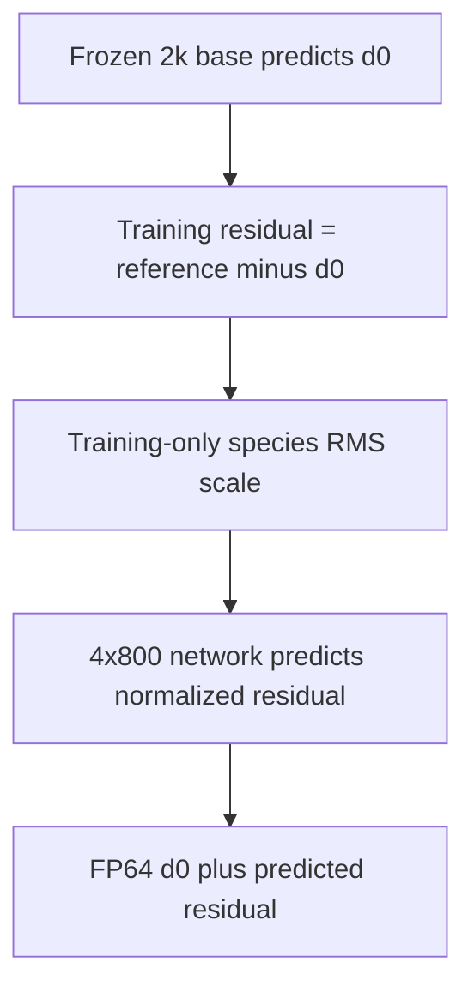

<a id="deep-state-boxcox"></a>
### Transformed-state increment — 8-layer control

Artifact ID: `deep-state-boxcox`. Family: Capacity control.

8x800 GELU, 2,000 updates. Approximate parameter/work control for two networks; measured CPU time is not forced equal.

```mermaid
flowchart TD
  n0["T, pressure, composition"]
  n1["Training-only input scaling"]
  n2["Dense network predicts transformed-state increment"]
  n3["Undo target scaling and coordinate transform"]
  n4["Physical increment prediction"]
  n0 --> n1
  n1 --> n2
  n2 --> n3
  n3 --> n4
```

<a id="continue-coordinate"></a>
### Transformed-state coordinate continuation

Artifact ID: `continue-coordinate`. Family: Warm-start loss changes.

4,000 additional updates on the verified 4k base with its coordinate loss; 8k total updates.

```mermaid
flowchart TD
  n0["Verified 4k transformed-state network"]
  n1["4k further updates: coordinate loss"]
  n2["Same transformed-state inverse"]
  n3["Physical increment prediction"]
  n0 --> n1
  n1 --> n2
  n2 --> n3
```

<a id="finetune-physical"></a>
### Transformed-state physical fine-tuning

Artifact ID: `finetune-physical`. Family: Warm-start loss changes.

4,000 additional updates, mean log1p(abs(physical error)/budget). Output representation stays unchanged.

```mermaid
flowchart TD
  n0["Verified 4k transformed-state network"]
  n1["4k further updates: physical loss"]
  n2["Same transformed-state inverse"]
  n3["Physical increment prediction"]
  n0 --> n1
  n1 --> n2
  n2 --> n3
```

<a id="finetune-tail"></a>
### Transformed-state tail fine-tuning

Artifact ID: `finetune-tail`. Family: Warm-start loss changes.

Physical fine-tuning plus 0.25 times the mean worst-eight-species loss per state. Not the ADA-CVaR sampling algorithm.

```mermaid
flowchart TD
  n0["Verified 4k transformed-state network"]
  n1["4k further updates: physical plus tail loss"]
  n2["Same transformed-state inverse"]
  n3["Physical increment prediction"]
  n0 --> n1
  n1 --> n2
  n2 --> n3
```

<a id="relative-correction"></a>
### Base-relative asinh correction

Artifact ID: `relative-correction`. Family: Residual corrections.

Frozen 4k base, zero-initialized 4x256 correction, 4k updates. Scale = 1e-14 + abs(base prediction), available at inference. It does not use reference-dependent decoding.

```mermaid
flowchart TD
  n0["Input state"]
  n1["Frozen 4k base predicts d0"]
  n2["4x256 network predicts local-asinh correction"]
  n3["Scale from 1e-14 + abs(d0), not reference"]
  n4["Stable inverse gives corrected increment"]
  n5["Training uses physical normalized error"]
  n0 --> n1
  n1 --> n2
  n2 --> n3
  n3 --> n4
  n4 --> n5
```

<a id="protected-correction"></a>
### Protected base-relative asinh correction

Artifact ID: `protected-correction`. Family: Residual corrections.

Same correction plus tail loss and training-only penalty for damaging previously passing components. This does not guarantee non-regression on new states.

```mermaid
flowchart TD
  n0["Input state"]
  n1["Frozen 4k base predicts d0"]
  n2["4x256 network predicts local-asinh correction"]
  n3["Scale from 1e-14 + abs(d0), not reference"]
  n4["Stable inverse gives corrected increment"]
  n5["Training adds tail and non-regression penalties"]
  n0 --> n1
  n1 --> n2
  n2 --> n3
  n3 --> n4
  n4 --> n5
```

<a id="local-state"></a>
### Local RBF — transformed-state increment

Artifact ID: `local-state`. Family: Local tables.

128-neighbor cubic radial-basis interpolation, degree-one polynomial, smoothing 1e-8. Training-only numerical-rank basis. Not ISAT or certified tabulation.

```mermaid
flowchart TD
  n0["Input state"]
  n1["Training-only scaling and rank reduction"]
  n2["128 nearest training neighbors"]
  n3["Cubic RBF predicts transformed-state increment"]
  n4["Inverse coordinate gives increment"]
  n0 --> n1
  n1 --> n2
  n2 --> n3
  n3 --> n4
```

<a id="local-asinh"></a>
### Local RBF — tolerance-scale asinh

Artifact ID: `local-asinh`. Family: Local tables.

Same local table with asinh(d/1e-14) coordinates. Fixed multiplicative coordinate factors do not change the reconstructed interpolant. Query cost includes the local solve.

```mermaid
flowchart TD
  n0["Input state"]
  n1["Training-only scaling and rank reduction"]
  n2["128 nearest training neighbors"]
  n3["Cubic RBF predicts tolerance-scale asinh"]
  n4["Inverse coordinate gives increment"]
  n0 --> n1
  n1 --> n2
  n2 --> n3
  n3 --> n4
```

<a id="arrhenius-heads"></a>
### Log-partial-pressure heads — Adam

Artifact ID: `arrhenius-heads`. Family: Input and architecture changes.

Separate 2x32 tanh species heads. 4k coordinate updates then 4k physical updates. Standardized asinh(d/1e-14). The historical arrhenius ID denotes motivated inputs, not an exact Arrhenius law.

```mermaid
flowchart TD
  n0["T, pressure, composition"]
  n1["Inverse T, log pressure, log-like partial pressures"]
  n2["Separate 2x32 tanh network per species"]
  n3["4k coordinate warmup"]
  n4["4k Adam physical-loss updates"]
  n5["Inverse asinh gives increment"]
  n0 --> n1
  n1 --> n2
  n2 --> n3
  n3 --> n4
  n4 --> n5
```

<a id="arrhenius-lbfgs"></a>
### Log-partial-pressure heads — L-BFGS/RMS

Artifact ID: `arrhenius-lbfgs`. Family: Input and architecture changes.

Same coordinate warmup, then 80 full-batch L-BFGS steps, maximum 400 closure evaluations, species-RMS physical objective. Changes optimizer and loss together.

```mermaid
flowchart TD
  n0["T, pressure, composition"]
  n1["Inverse T, log pressure, log-like partial pressures"]
  n2["Separate 2x32 tanh network per species"]
  n3["4k coordinate warmup"]
  n4["80 full-batch L-BFGS/RMS steps"]
  n5["Inverse asinh gives increment"]
  n0 --> n1
  n1 --> n2
  n2 --> n3
  n3 --> n4
  n4 --> n5
```

<a id="arrhenius-local"></a>
### Log-partial-pressure local RBF

Artifact ID: `arrhenius-local`. Family: Input and architecture changes.

New inverse-T/log-partial-pressure inputs with the same local asinh interpolation. It has no neural training or base predictor.

```mermaid
flowchart TD
  n0["Input state"]
  n1["Inverse T and log-like partial pressures"]
  n2["Training-only scaling and rank reduction"]
  n3["128-neighbor asinh RBF"]
  n4["Inverse asinh gives increment"]
  n0 --> n1
  n1 --> n2
  n2 --> n3
  n3 --> n4
```

<a id="rate-euler"></a>
### Initial-rate Euler control

Artifact ID: `rate-euler`. Family: Non-learned kinetics controls.

Actual mechanism evaluation at inference. One explicit fixed step, no learned weights and no adaptive error control.

```mermaid
flowchart TD
  n0["Input state"]
  n1["Mechanism gives initial net species rates"]
  n2["Multiply rates by interval"]
  n3["Physical increment prediction"]
  n0 --> n1
  n1 --> n2
  n2 --> n3
```

<a id="frozen-exponential"></a>
### Frozen production–destruction control

Artifact ID: `frozen-exponential`. Family: Non-learned kinetics controls.

Freeze species production and destruction coefficients during the interval; use stable expm1 reconstruction. Positivity does not imply conservation or accuracy.

```mermaid
flowchart TD
  n0["Input state"]
  n1["Mechanism gives production and destruction"]
  n2["Freeze each species coefficient"]
  n3["Analytic scalar exponential step"]
  n4["Physical increment prediction"]
  n0 --> n1
  n1 --> n2
  n2 --> n3
  n3 --> n4
```

## Executable sources

- [Original coordinates](../benchmarks/flame_conditioning/coordinates.py) and [learning settings](../benchmarks/offline_accuracy/learning.json).
- [Refinement plan](../benchmarks/offline_accuracy/refinement/plan.py) and [coordinates](../benchmarks/offline_accuracy/refinement/coordinates.py).
- [Adaptation plan](../benchmarks/offline_accuracy/improve/plan.py), [neural fitting](../benchmarks/offline_accuracy/improve/neural.py), [local fitting](../benchmarks/offline_accuracy/improve/local.py), and [input/head adaptation](../benchmarks/offline_accuracy/improve/arrhenius.py).
- [Non-learned controls](../benchmarks/offline_accuracy/improve/physics_prior.py).

Executable plans and saved run configurations own numerical parameters. This registry owns review names, diagrams and alias mappings. A display-name change never rewrites a run artifact.
