# Chemistry method catalogue

> Generated from [the canonical registry](../benchmarks/flame_conditioning/report-content/method-catalogue.mjs). Do not edit this page by hand. Run `node scripts/build_research_method_catalogue.mjs --write` after changing the registry or renderer.

This is the naming and diagram reference for the offline representation study. The [live report](https://xiao312.github.io/DFODE-kit/flame-conditioning/) contains measured results and the split/tolerance review guide. [Issue #3](https://github.com/xiao312/DFODE-kit/issues/3) records decisions. Old comments and artifact IDs remain historical records; use the mappings here to read them.

The [accuracy protocol](agents/representation-accuracy-success-sources.md#required-dual-scaling-protocol-for-later-runs) distinguishes CVODE tolerance parameters, state-based error scaling, increment-based error scaling and custom magnitude-dependent budgets. Later runs must compare both error scales; the existing results are unchanged.

## Three different concepts

1. **Representation:** the coordinate system for a signed physical increment.
2. **Method recipe:** input features, representation, approximator, loss and optimization.
3. **Run:** recipe plus dataset, split, seed, precision and work budget.

Changing a seed does not create a new method. Sharing an asinh transform does not make two recipes identical. The historical `arrhenius-*` IDs mean inverse-temperature and log-partial-pressure features, not an exact Arrhenius law. A matched GBCT target adaptation is implemented; full GBCTNet reproduction, ISAT and spectrum-informed MSNN are not. See the [GBCT source check](agents/gbct-source-and-adaptation.md).

## Data split sequence

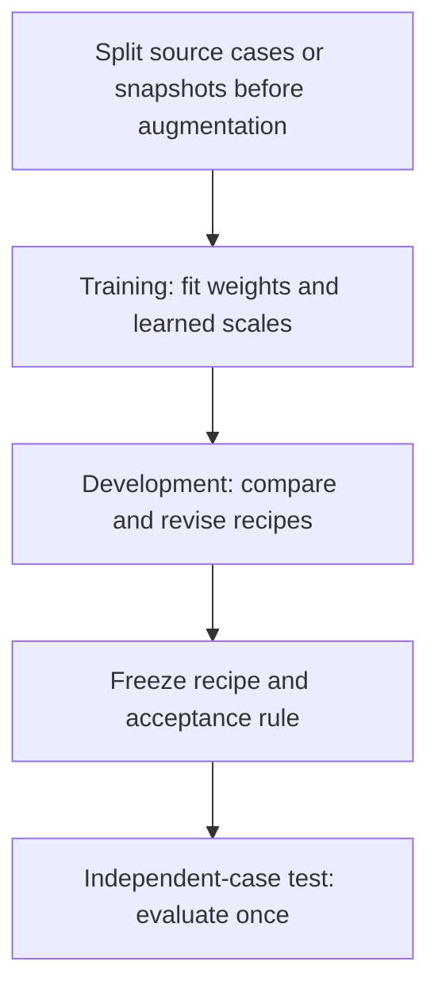

Current campaign: 10,000 selected training states per seed from 10,010 accepted rows; 1,023 development states. Four training and two development snapshots come from one flame realization. Development has been inspected repeatedly. Current independent-test performance is **not evaluated**, not zero. Older CFD test results concern older models. Local-table training scores are resubstitution scores, not leave-one-out validation.

## Representation index

Here d=delta Y, Y is the initial mass fraction, and z is the encoded target before recipe-specific scaling. Encoding uses reference labels during fitting. Inference predicts z from inputs and applies the inverse; it cannot inspect the unknown reference increment.

<a id="representation-state-boxcox"></a>
### Transformed-state increment

Representation ID: `state-boxcox`.

`z = B(Y + d) - B(Y), B(y) = (y^0.1 - 1)/0.1`

Transform the states, then take their coordinate difference. Stable log1p/expm1 algebra avoids avoidable cancellation. Invalid predicted inverse domains are corrected and counted.

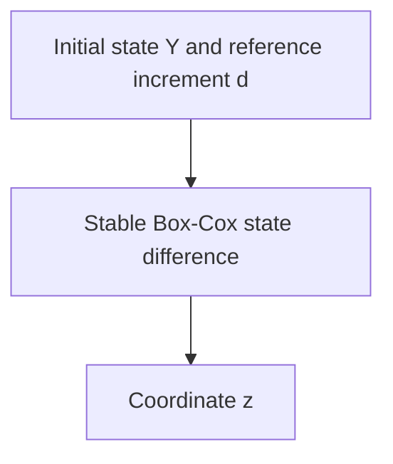

<a id="representation-signed-power"></a>
### Direct signed-power increment

Representation ID: `signed-power`.

`z = sign(d) * abs(d)^0.1 / 0.1`

Transform the signed physical increment directly. This is not the GBCT composition.

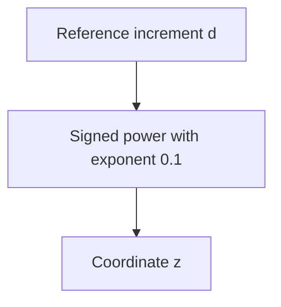

<a id="representation-budget-linear"></a>
### State-budget linear increment

Representation ID: `budget-linear`.

`z = d / (1e-12 + 1e-6 * abs(Y))`

Scale by the initial-state budget. This scale is not the increment-acceptance budget and does not use an unknown future reference at inference.

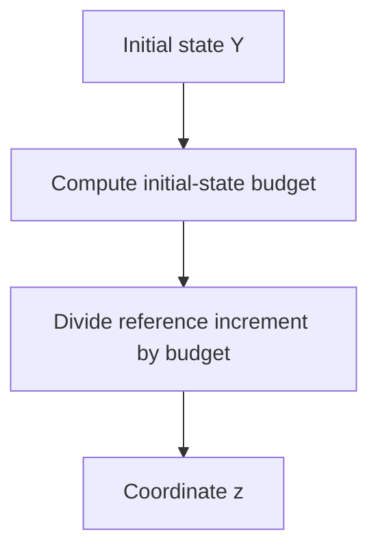

<a id="representation-scaled-asinh"></a>
### Empirical-scale asinh increment

Representation ID: `scaled-asinh`.

`z = asinh(d / s_i)`

Fit species scales s_i on training rows only. The scale is not a test-fitted parameter or a numerical accuracy guarantee.

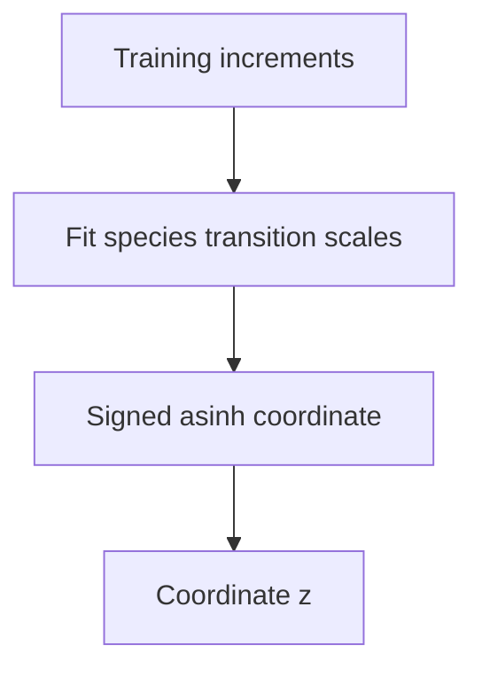

<a id="representation-budget-log"></a>
### Tolerance-scale signed-log increment

Representation ID: `budget-log`.

`z = sign(d) * log1p(r * abs(d) / a) / r`

Use a=1e-15 and r=0.1. The derivative is exactly 1/(a+r*abs(d)); this aligns small coordinate errors locally with the chosen increment budget.

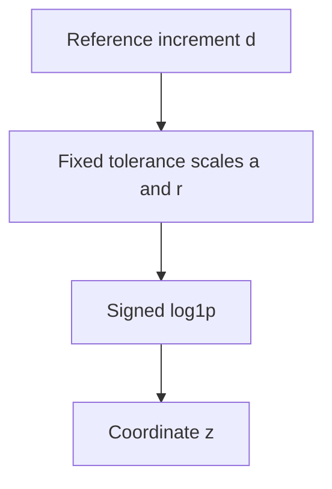

<a id="representation-budget-asinh"></a>
### Tolerance-scale asinh increment

Representation ID: `budget-asinh`.

`z = asinh(r * d / a) / r`

Use a=1e-15 and r=0.1. The derivative is 1/sqrt(a^2+r^2*d^2), not exactly the additive acceptance rule.


<a id="representation-gbct"></a>
### GBCT transformed-state rate

Representation ID: `gbct`.

`z = sign(q) * abs(q)^0.5 / 0.5; q = [B(Y+d)-B(Y)]/h; B power = 0.1`

Matched target adaptation of GBCT, with h=1e-6 s. Stable state difference, signed square-root rate, then train-only mean/RMS normalization. Not a reproduction of the published network, dataset or loader normalization.

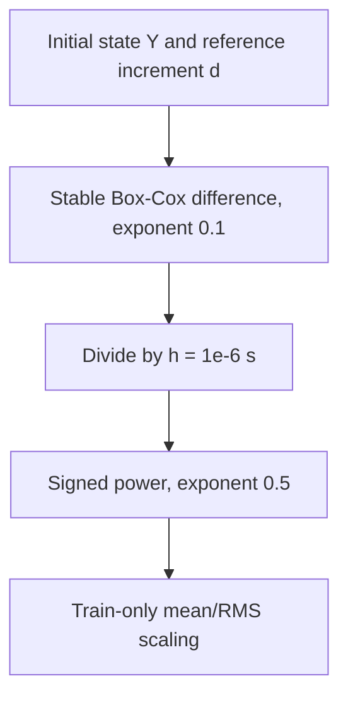

## Method index

Click a method name for its steps. Diagrams summarize the recipe, including fitting where labelled; they are not per-query cost diagrams.

| Stable artifact ID | Canonical name | Family |
| --- | --- | --- |
| `adaptive-continue` | [GBCT baseline — warm-start control](#adaptive-continue) | Adaptive residual coordinates |
| `adaptive-local` | [Fixed local residual correction](#adaptive-local) | Adaptive residual coordinates |
| `adaptive-calibrated` | [Residual-calibrated local correction](#adaptive-calibrated) | Adaptive residual coordinates |
| `matched200k-state-boxcox-coordinate` | [Transformed-state increment — matched 200k coordinate loss](#matched200k-state-boxcox-coordinate) | Matched 200k targets and losses |
| `matched200k-state-boxcox-increment` | [Transformed-state increment — matched 200k increment loss](#matched200k-state-boxcox-increment) | Matched 200k targets and losses |
| `matched200k-state-boxcox-state` | [Transformed-state increment — matched 200k state loss](#matched200k-state-boxcox-state) | Matched 200k targets and losses |
| `matched200k-signed-power-coordinate` | [Direct signed-power increment — matched 200k coordinate loss](#matched200k-signed-power-coordinate) | Matched 200k targets and losses |
| `matched200k-signed-power-increment` | [Direct signed-power increment — matched 200k increment loss](#matched200k-signed-power-increment) | Matched 200k targets and losses |
| `matched200k-signed-power-state` | [Direct signed-power increment — matched 200k state loss](#matched200k-signed-power-state) | Matched 200k targets and losses |
| `matched200k-scaled-asinh-coordinate` | [Empirical-scale asinh increment — matched 200k coordinate loss](#matched200k-scaled-asinh-coordinate) | Matched 200k targets and losses |
| `matched200k-scaled-asinh-increment` | [Empirical-scale asinh increment — matched 200k increment loss](#matched200k-scaled-asinh-increment) | Matched 200k targets and losses |
| `matched200k-scaled-asinh-state` | [Empirical-scale asinh increment — matched 200k state loss](#matched200k-scaled-asinh-state) | Matched 200k targets and losses |
| `matched200k-gbct-coordinate` | [GBCT transformed-state rate — matched 200k coordinate loss](#matched200k-gbct-coordinate) | Matched 200k targets and losses |
| `matched200k-gbct-increment` | [GBCT transformed-state rate — matched 200k increment loss](#matched200k-gbct-increment) | Matched 200k targets and losses |
| `matched200k-gbct-state` | [GBCT transformed-state rate — matched 200k state loss](#matched200k-gbct-state) | Matched 200k targets and losses |
| `fuel-state` | [Transformed-state increment — Fuel source recipe](#fuel-state) | Fuel source-recipe replication |
| `fuel-power` | [Direct signed-power increment — Fuel source recipe](#fuel-power) | Fuel source-recipe replication |
| `fuel-state-matched-work` | [Transformed-state increment — matched-work control](#fuel-state-matched-work) | Matched-update data-size comparison |
| `fuel-power-matched-work` | [Direct signed-power increment — matched-work control](#fuel-power-matched-work) | Matched-update data-size comparison |
| `fuel-state-budget` | [Transformed-state increment — fixed-data budget control](#fuel-state-budget) | Fixed-data training-budget comparison |
| `fuel-power-budget` | [Direct signed-power increment — fixed-data budget control](#fuel-power-budget) | Fixed-data training-budget comparison |
| `state-boxcox-coordinate` | [Transformed-state increment — paired coordinate loss](#state-boxcox-coordinate) | Paired target and error-scale comparison |
| `state-boxcox-increment` | [Transformed-state increment — paired increment loss](#state-boxcox-increment) | Paired target and error-scale comparison |
| `state-boxcox-state` | [Transformed-state increment — paired state loss](#state-boxcox-state) | Paired target and error-scale comparison |
| `gbct-coordinate` | [GBCT transformed-state rate — paired coordinate loss](#gbct-coordinate) | Paired target and error-scale comparison |
| `gbct-increment` | [GBCT transformed-state rate — paired increment loss](#gbct-increment) | Paired target and error-scale comparison |
| `gbct-state` | [GBCT transformed-state rate — paired state loss](#gbct-state) | Paired target and error-scale comparison |
| `original-state-boxcox` | [Transformed-state increment — 2k updates](#original-state-boxcox) | Matched dense networks |
| `long-state-boxcox` | [Transformed-state increment — 4k updates](#long-state-boxcox) | Matched dense networks |
| `original-signed-power` | [Direct signed-power increment — 2k updates](#original-signed-power) | Matched dense networks |
| `long-signed-power` | [Direct signed-power increment — 4k updates](#long-signed-power) | Matched dense networks |
| `original-budget-linear` | [State-budget linear increment — 2k updates](#original-budget-linear) | Matched dense networks |
| `long-budget-linear` | [State-budget linear increment — 4k updates](#long-budget-linear) | Matched dense networks |
| `original-scaled-asinh` | [Empirical-scale asinh increment — 2k updates](#original-scaled-asinh) | Matched dense networks |
| `long-scaled-asinh` | [Empirical-scale asinh increment — 4k updates](#long-scaled-asinh) | Matched dense networks |
| `budget-log` | [Tolerance-scale signed-log increment](#budget-log) | Tolerance-derived targets |
| `physical-budget-log` | [Tolerance-scale signed-log increment + physical loss](#physical-budget-log) | Tolerance-derived targets |
| `budget-asinh` | [Tolerance-scale asinh increment](#budget-asinh) | Tolerance-derived targets |
| `physical-budget-asinh` | [Tolerance-scale asinh increment + physical loss](#physical-budget-asinh) | Tolerance-derived targets |
| `residual-state-boxcox` | [RMS-scaled additive residual](#residual-state-boxcox) | Residual corrections |
| `deep-state-boxcox` | [Transformed-state increment — 8-layer control](#deep-state-boxcox) | Capacity control |
| `continue-coordinate` | [Transformed-state coordinate continuation](#continue-coordinate) | Warm-start loss changes |
| `finetune-physical` | [Transformed-state physical fine-tuning](#finetune-physical) | Warm-start loss changes |
| `finetune-tail` | [Transformed-state tail fine-tuning](#finetune-tail) | Warm-start loss changes |
| `relative-correction` | [Base-relative asinh correction](#relative-correction) | Residual corrections |
| `protected-correction` | [Protected base-relative asinh correction](#protected-correction) | Residual corrections |
| `local-state` | [Local RBF — transformed-state increment](#local-state) | Local tables |
| `local-asinh` | [Local RBF — tolerance-scale asinh](#local-asinh) | Local tables |
| `arrhenius-heads` | [Log-partial-pressure heads — Adam](#arrhenius-heads) | Input and architecture changes |
| `arrhenius-lbfgs` | [Log-partial-pressure heads — L-BFGS/RMS](#arrhenius-lbfgs) | Input and architecture changes |
| `arrhenius-local` | [Log-partial-pressure local RBF](#arrhenius-local) | Input and architecture changes |
| `rate-euler` | [Initial-rate Euler control](#rate-euler) | Non-learned kinetics controls |
| `frozen-exponential` | [Frozen production–destruction control](#frozen-exponential) | Non-learned kinetics controls |

Report aliases: `base` → `long-state-boxcox`.

The zero-increment control always returns zero; it is not fitted.

## Method steps

<a id="adaptive-continue"></a>
### GBCT baseline — warm-start control

Artifact ID: `adaptive-continue`. Family: Adaptive residual coordinates.

Frozen 200k dataset and verified GBCT/increment base. Two seeds, 6k extra updates, batch 10k, fresh Adam, cosine 1e-4 to 1e-6, final checkpoint. Same physical increment loss and both evaluation policies. Continuation fits the base; corrections freeze it and add a zero-output 3x256 GELU model with normalized physical and asinh(base) features. Decoder: base+(1e-14+abs(base))*alpha(base)*correction. Local alpha=1; calibrated alpha uses bounded conditional training-residual 75th percentiles in eight fixed magnitude bins, fit on 50k training rows only. No positivity projection or test access. Scale is not an acceptance tolerance. Experimental, not a demonstrated improvement or MSNN reproduction.

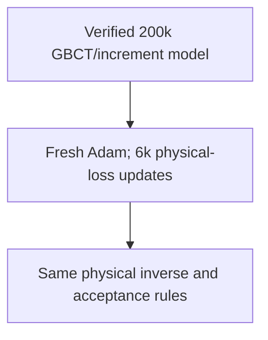

<a id="adaptive-local"></a>
### Fixed local residual correction

Artifact ID: `adaptive-local`. Family: Adaptive residual coordinates.

Frozen 200k dataset and verified GBCT/increment base. Two seeds, 6k extra updates, batch 10k, fresh Adam, cosine 1e-4 to 1e-6, final checkpoint. Same physical increment loss and both evaluation policies. Continuation fits the base; corrections freeze it and add a zero-output 3x256 GELU model with normalized physical and asinh(base) features. Decoder: base+(1e-14+abs(base))*alpha(base)*correction. Local alpha=1; calibrated alpha uses bounded conditional training-residual 75th percentiles in eight fixed magnitude bins, fit on 50k training rows only. No positivity projection or test access. Scale is not an acceptance tolerance. Experimental, not a demonstrated improvement or MSNN reproduction.

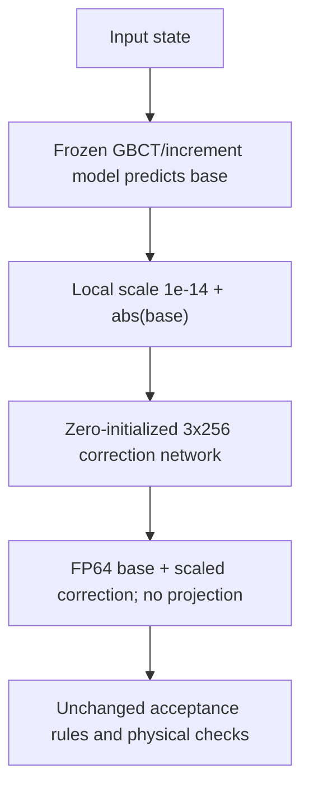

<a id="adaptive-calibrated"></a>
### Residual-calibrated local correction

Artifact ID: `adaptive-calibrated`. Family: Adaptive residual coordinates.

Frozen 200k dataset and verified GBCT/increment base. Two seeds, 6k extra updates, batch 10k, fresh Adam, cosine 1e-4 to 1e-6, final checkpoint. Same physical increment loss and both evaluation policies. Continuation fits the base; corrections freeze it and add a zero-output 3x256 GELU model with normalized physical and asinh(base) features. Decoder: base+(1e-14+abs(base))*alpha(base)*correction. Local alpha=1; calibrated alpha uses bounded conditional training-residual 75th percentiles in eight fixed magnitude bins, fit on 50k training rows only. No positivity projection or test access. Scale is not an acceptance tolerance. Experimental, not a demonstrated improvement or MSNN reproduction.

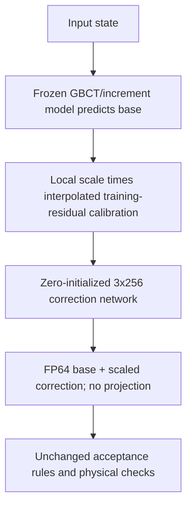

<a id="matched200k-state-boxcox-coordinate"></a>
### Transformed-state increment — matched 200k coordinate loss

Artifact ID: `matched200k-state-boxcox-coordinate`. Family: Matched 200k targets and losses.

Fixed 200k rows, mean/sample-standard-deviation scalers fitted on the same 50k prefix. Fresh 4x800 GELU, 58 non-AR outputs, batch 10k. Common 18k schedule: 6k each at 1e-3/1e-4/1e-5, with Adam reset each stage. First 12k coordinate L1, last 6k selected loss. Physical loss is mean log1p(error/allowance), a=1e-15 and r=.1; increment scale abs(d), state scale abs(Y+d). Asinh scale 1e-14; GBCT a=.1,b=.5,h=1e-6. FP32 fit/FP64 inverse, final checkpoint. Not an original paper recipe.

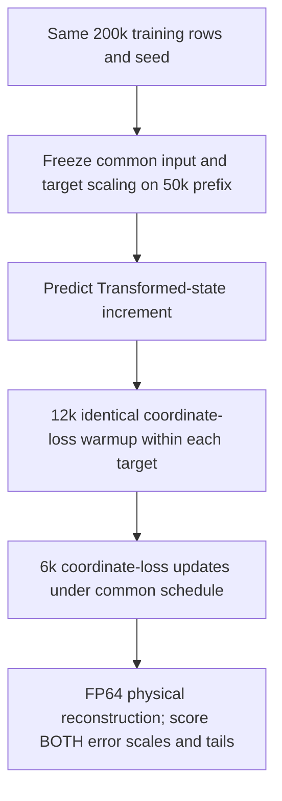

<a id="matched200k-state-boxcox-increment"></a>
### Transformed-state increment — matched 200k increment loss

Artifact ID: `matched200k-state-boxcox-increment`. Family: Matched 200k targets and losses.

Fixed 200k rows, mean/sample-standard-deviation scalers fitted on the same 50k prefix. Fresh 4x800 GELU, 58 non-AR outputs, batch 10k. Common 18k schedule: 6k each at 1e-3/1e-4/1e-5, with Adam reset each stage. First 12k coordinate L1, last 6k selected loss. Physical loss is mean log1p(error/allowance), a=1e-15 and r=.1; increment scale abs(d), state scale abs(Y+d). Asinh scale 1e-14; GBCT a=.1,b=.5,h=1e-6. FP32 fit/FP64 inverse, final checkpoint. Not an original paper recipe.

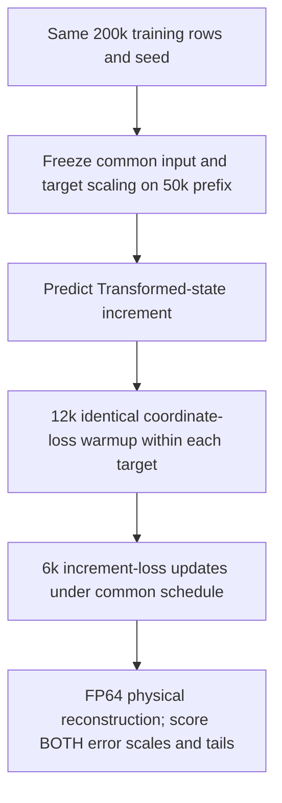

<a id="matched200k-state-boxcox-state"></a>
### Transformed-state increment — matched 200k state loss

Artifact ID: `matched200k-state-boxcox-state`. Family: Matched 200k targets and losses.

Fixed 200k rows, mean/sample-standard-deviation scalers fitted on the same 50k prefix. Fresh 4x800 GELU, 58 non-AR outputs, batch 10k. Common 18k schedule: 6k each at 1e-3/1e-4/1e-5, with Adam reset each stage. First 12k coordinate L1, last 6k selected loss. Physical loss is mean log1p(error/allowance), a=1e-15 and r=.1; increment scale abs(d), state scale abs(Y+d). Asinh scale 1e-14; GBCT a=.1,b=.5,h=1e-6. FP32 fit/FP64 inverse, final checkpoint. Not an original paper recipe.

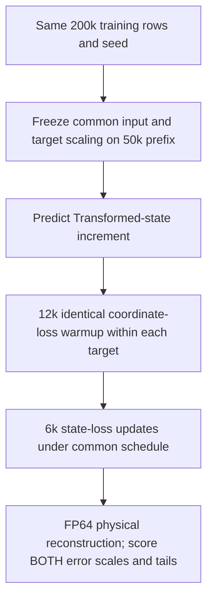

<a id="matched200k-signed-power-coordinate"></a>
### Direct signed-power increment — matched 200k coordinate loss

Artifact ID: `matched200k-signed-power-coordinate`. Family: Matched 200k targets and losses.

Fixed 200k rows, mean/sample-standard-deviation scalers fitted on the same 50k prefix. Fresh 4x800 GELU, 58 non-AR outputs, batch 10k. Common 18k schedule: 6k each at 1e-3/1e-4/1e-5, with Adam reset each stage. First 12k coordinate L1, last 6k selected loss. Physical loss is mean log1p(error/allowance), a=1e-15 and r=.1; increment scale abs(d), state scale abs(Y+d). Asinh scale 1e-14; GBCT a=.1,b=.5,h=1e-6. FP32 fit/FP64 inverse, final checkpoint. Not an original paper recipe.

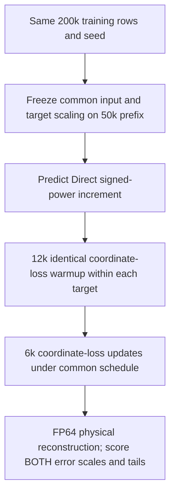

<a id="matched200k-signed-power-increment"></a>
### Direct signed-power increment — matched 200k increment loss

Artifact ID: `matched200k-signed-power-increment`. Family: Matched 200k targets and losses.

Fixed 200k rows, mean/sample-standard-deviation scalers fitted on the same 50k prefix. Fresh 4x800 GELU, 58 non-AR outputs, batch 10k. Common 18k schedule: 6k each at 1e-3/1e-4/1e-5, with Adam reset each stage. First 12k coordinate L1, last 6k selected loss. Physical loss is mean log1p(error/allowance), a=1e-15 and r=.1; increment scale abs(d), state scale abs(Y+d). Asinh scale 1e-14; GBCT a=.1,b=.5,h=1e-6. FP32 fit/FP64 inverse, final checkpoint. Not an original paper recipe.

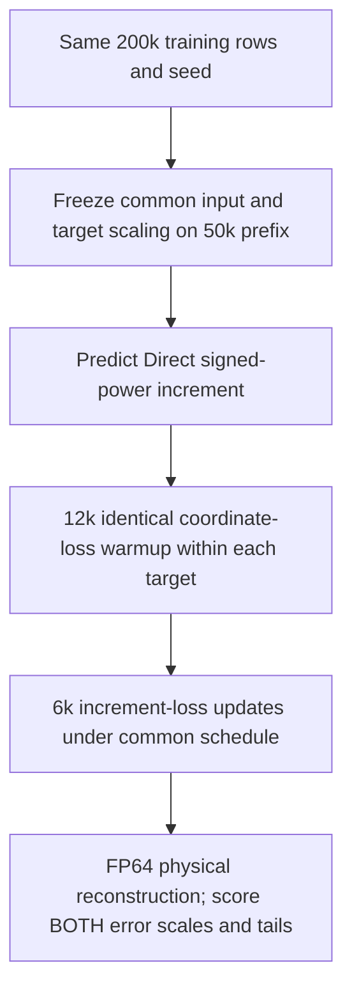

<a id="matched200k-signed-power-state"></a>
### Direct signed-power increment — matched 200k state loss

Artifact ID: `matched200k-signed-power-state`. Family: Matched 200k targets and losses.

Fixed 200k rows, mean/sample-standard-deviation scalers fitted on the same 50k prefix. Fresh 4x800 GELU, 58 non-AR outputs, batch 10k. Common 18k schedule: 6k each at 1e-3/1e-4/1e-5, with Adam reset each stage. First 12k coordinate L1, last 6k selected loss. Physical loss is mean log1p(error/allowance), a=1e-15 and r=.1; increment scale abs(d), state scale abs(Y+d). Asinh scale 1e-14; GBCT a=.1,b=.5,h=1e-6. FP32 fit/FP64 inverse, final checkpoint. Not an original paper recipe.

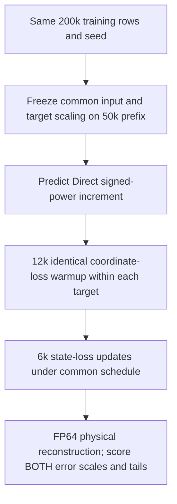

<a id="matched200k-scaled-asinh-coordinate"></a>
### Empirical-scale asinh increment — matched 200k coordinate loss

Artifact ID: `matched200k-scaled-asinh-coordinate`. Family: Matched 200k targets and losses.

Fixed 200k rows, mean/sample-standard-deviation scalers fitted on the same 50k prefix. Fresh 4x800 GELU, 58 non-AR outputs, batch 10k. Common 18k schedule: 6k each at 1e-3/1e-4/1e-5, with Adam reset each stage. First 12k coordinate L1, last 6k selected loss. Physical loss is mean log1p(error/allowance), a=1e-15 and r=.1; increment scale abs(d), state scale abs(Y+d). Asinh scale 1e-14; GBCT a=.1,b=.5,h=1e-6. FP32 fit/FP64 inverse, final checkpoint. Not an original paper recipe.

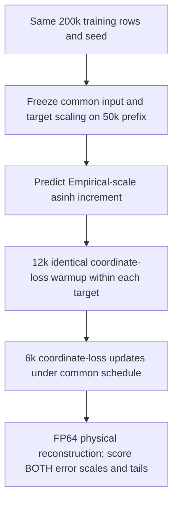

<a id="matched200k-scaled-asinh-increment"></a>
### Empirical-scale asinh increment — matched 200k increment loss

Artifact ID: `matched200k-scaled-asinh-increment`. Family: Matched 200k targets and losses.

Fixed 200k rows, mean/sample-standard-deviation scalers fitted on the same 50k prefix. Fresh 4x800 GELU, 58 non-AR outputs, batch 10k. Common 18k schedule: 6k each at 1e-3/1e-4/1e-5, with Adam reset each stage. First 12k coordinate L1, last 6k selected loss. Physical loss is mean log1p(error/allowance), a=1e-15 and r=.1; increment scale abs(d), state scale abs(Y+d). Asinh scale 1e-14; GBCT a=.1,b=.5,h=1e-6. FP32 fit/FP64 inverse, final checkpoint. Not an original paper recipe.


<a id="matched200k-scaled-asinh-state"></a>
### Empirical-scale asinh increment — matched 200k state loss

Artifact ID: `matched200k-scaled-asinh-state`. Family: Matched 200k targets and losses.

Fixed 200k rows, mean/sample-standard-deviation scalers fitted on the same 50k prefix. Fresh 4x800 GELU, 58 non-AR outputs, batch 10k. Common 18k schedule: 6k each at 1e-3/1e-4/1e-5, with Adam reset each stage. First 12k coordinate L1, last 6k selected loss. Physical loss is mean log1p(error/allowance), a=1e-15 and r=.1; increment scale abs(d), state scale abs(Y+d). Asinh scale 1e-14; GBCT a=.1,b=.5,h=1e-6. FP32 fit/FP64 inverse, final checkpoint. Not an original paper recipe.

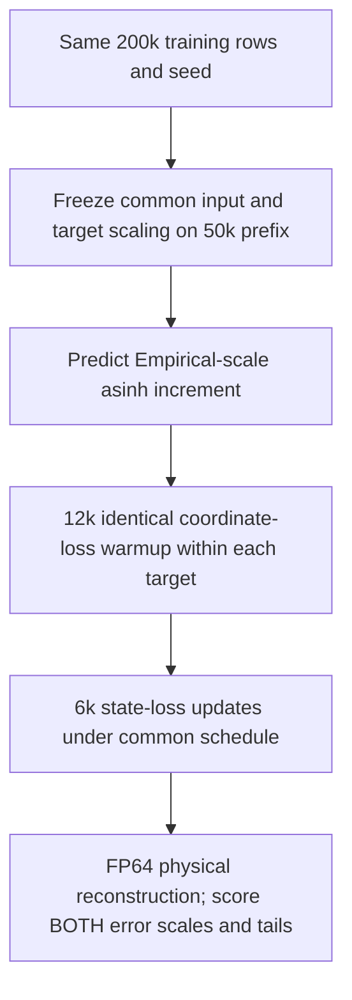

<a id="matched200k-gbct-coordinate"></a>
### GBCT transformed-state rate — matched 200k coordinate loss

Artifact ID: `matched200k-gbct-coordinate`. Family: Matched 200k targets and losses.

Fixed 200k rows, mean/sample-standard-deviation scalers fitted on the same 50k prefix. Fresh 4x800 GELU, 58 non-AR outputs, batch 10k. Common 18k schedule: 6k each at 1e-3/1e-4/1e-5, with Adam reset each stage. First 12k coordinate L1, last 6k selected loss. Physical loss is mean log1p(error/allowance), a=1e-15 and r=.1; increment scale abs(d), state scale abs(Y+d). Asinh scale 1e-14; GBCT a=.1,b=.5,h=1e-6. FP32 fit/FP64 inverse, final checkpoint. Not an original paper recipe.

```mermaid
flowchart TD
  n0["Same 200k training rows and seed"]
  n1["Freeze common input and target scaling on 50k prefix"]
  n2["Predict GBCT transformed-state rate"]
  n3["12k identical coordinate-loss warmup within each target"]
  n4["6k coordinate-loss updates under common schedule"]
  n5["FP64 physical reconstruction; score BOTH error scales and tails"]
  n0 --> n1
  n1 --> n2
  n2 --> n3
  n3 --> n4
  n4 --> n5
```

<a id="matched200k-gbct-increment"></a>
### GBCT transformed-state rate — matched 200k increment loss

Artifact ID: `matched200k-gbct-increment`. Family: Matched 200k targets and losses.

Fixed 200k rows, mean/sample-standard-deviation scalers fitted on the same 50k prefix. Fresh 4x800 GELU, 58 non-AR outputs, batch 10k. Common 18k schedule: 6k each at 1e-3/1e-4/1e-5, with Adam reset each stage. First 12k coordinate L1, last 6k selected loss. Physical loss is mean log1p(error/allowance), a=1e-15 and r=.1; increment scale abs(d), state scale abs(Y+d). Asinh scale 1e-14; GBCT a=.1,b=.5,h=1e-6. FP32 fit/FP64 inverse, final checkpoint. Not an original paper recipe.

```mermaid
flowchart TD
  n0["Same 200k training rows and seed"]
  n1["Freeze common input and target scaling on 50k prefix"]
  n2["Predict GBCT transformed-state rate"]
  n3["12k identical coordinate-loss warmup within each target"]
  n4["6k increment-loss updates under common schedule"]
  n5["FP64 physical reconstruction; score BOTH error scales and tails"]
  n0 --> n1
  n1 --> n2
  n2 --> n3
  n3 --> n4
  n4 --> n5
```

<a id="matched200k-gbct-state"></a>
### GBCT transformed-state rate — matched 200k state loss

Artifact ID: `matched200k-gbct-state`. Family: Matched 200k targets and losses.

Fixed 200k rows, mean/sample-standard-deviation scalers fitted on the same 50k prefix. Fresh 4x800 GELU, 58 non-AR outputs, batch 10k. Common 18k schedule: 6k each at 1e-3/1e-4/1e-5, with Adam reset each stage. First 12k coordinate L1, last 6k selected loss. Physical loss is mean log1p(error/allowance), a=1e-15 and r=.1; increment scale abs(d), state scale abs(Y+d). Asinh scale 1e-14; GBCT a=.1,b=.5,h=1e-6. FP32 fit/FP64 inverse, final checkpoint. Not an original paper recipe.

```mermaid
flowchart TD
  n0["Same 200k training rows and seed"]
  n1["Freeze common input and target scaling on 50k prefix"]
  n2["Predict GBCT transformed-state rate"]
  n3["12k identical coordinate-loss warmup within each target"]
  n4["6k state-loss updates under common schedule"]
  n5["FP64 physical reconstruction; score BOTH error scales and tails"]
  n0 --> n1
  n1 --> n2
  n2 --> n3
  n3 --> n4
  n4 --> n5
```

<a id="fuel-state"></a>
### Transformed-state increment — Fuel source recipe

Artifact ID: `fuel-state`. Family: Fuel source-recipe replication.

4x800 GELU, 58 non-argon outputs, FP32 L1. Train-only centered sample-standard-deviation scaling. 1500 shuffled epochs; requested batch 20k capped at training count. Adam resets before epochs 502 and 1002 with tenfold LR drops. Stable FP64 inverse. Reduced-data diagnostic, not full paper reproduction.

```mermaid
flowchart TD
  n0["Same checked training states"]
  n1["Sample-standard-deviation input and target scaling"]
  n2["61 to 800x4 to 58 GELU network"]
  n3["1500 epochs; source Adam resets"]
  n4["Stable transformed-state inverse"]
  n5["Both error budgets and SSPI"]
  n0 --> n1
  n1 --> n2
  n2 --> n3
  n3 --> n4
  n4 --> n5
```

<a id="fuel-power"></a>
### Direct signed-power increment — Fuel source recipe

Artifact ID: `fuel-power`. Family: Fuel source-recipe replication.

4x800 GELU, 58 non-argon outputs, FP32 L1. Train-only population-standard-deviation scaling; zero target center, not RMS. 2000 shuffled epochs; requested batch 20k capped at training count. Tenfold LR drop every 500 epochs; retain Adam state. Stable FP64 inverse. Reduced-data diagnostic, not full paper reproduction.

```mermaid
flowchart TD
  n0["Same checked training states"]
  n1["Signed tenth-root increment; zero target center"]
  n2["Population-standard-deviation scaling"]
  n3["61 to 800x4 to 58 GELU network"]
  n4["2000 epochs; StepLR with Adam state retained"]
  n5["Direct power inverse; both budgets and SSPI"]
  n0 --> n1
  n1 --> n2
  n2 --> n3
  n3 --> n4
  n4 --> n5
```

<a id="fuel-state-matched-work"></a>
### Transformed-state increment — matched-work control

Artifact ID: `fuel-state-matched-work`. Family: Matched-update data-size comparison.

50k/200k nested rows, fixed 50k training-only scalers. Same seeded 4x800 GELU, FP32 L1, 6000 updates, batch 10k, 60M presentations. Three 2000-update LR stages; reset Adam. Final checkpoint, stable FP64 inverse. Not the original epoch schedule; compare sizes within each recipe.

```mermaid
flowchart TD
  n0["Nested 50k or 200k training rows"]
  n1["Freeze input and target scaling fitted on 50k"]
  n2["Same seeded 61 to 800x4 to 58 GELU network"]
  n3["6000 updates; 10k rows per update"]
  n4["Stable physical reconstruction"]
  n5["Same development states; both error policies"]
  n0 --> n1
  n1 --> n2
  n2 --> n3
  n3 --> n4
  n4 --> n5
```

<a id="fuel-power-matched-work"></a>
### Direct signed-power increment — matched-work control

Artifact ID: `fuel-power-matched-work`. Family: Matched-update data-size comparison.

50k/200k nested rows, fixed 50k training-only scalers. Same seeded 4x800 GELU, FP32 L1, 6000 updates, batch 10k, 60M presentations. Four 1500-update LR stages; retain Adam. Final checkpoint, stable FP64 inverse. Not the original epoch schedule; compare sizes within each recipe.

```mermaid
flowchart TD
  n0["Nested 50k or 200k training rows"]
  n1["Freeze input and target scaling fitted on 50k"]
  n2["Same seeded 61 to 800x4 to 58 GELU network"]
  n3["6000 updates; 10k rows per update"]
  n4["Stable physical reconstruction"]
  n5["Same development states; both error policies"]
  n0 --> n1
  n1 --> n2
  n2 --> n3
  n3 --> n4
  n4 --> n5
```

<a id="fuel-state-budget"></a>
### Transformed-state increment — fixed-data budget control

Artifact ID: `fuel-state-budget`. Family: Fixed-data training-budget comparison.

Same 200k rows, original 50k scalers, seed and first 6k batches. Fresh 6k/18k update fits, batch 10k, 60M/180M presentations. Stretch source-derived learning-rate stages threefold; keep recipe Adam policy. Same 4x800 GELU, FP32 L1 and FP64 inverse. Final checkpoint only; not continuation or pure schedule-isolated effect.

```mermaid
flowchart TD
  n0["Same checked 200k training pool"]
  n1["Freeze original 50k preprocessing"]
  n2["Same seeded 61 to 800x4 to 58 network"]
  n3["Fresh 6k or 18k update fit; proportional LR stages"]
  n4["Stable FP64 physical reconstruction"]
  n5["Same development rows; both error scales and zero control"]
  n0 --> n1
  n1 --> n2
  n2 --> n3
  n3 --> n4
  n4 --> n5
```

<a id="fuel-power-budget"></a>
### Direct signed-power increment — fixed-data budget control

Artifact ID: `fuel-power-budget`. Family: Fixed-data training-budget comparison.

Same 200k rows, original 50k scalers, seed and first 6k batches. Fresh 6k/18k update fits, batch 10k, 60M/180M presentations. Stretch source-derived learning-rate stages threefold; keep recipe Adam policy. Same 4x800 GELU, FP32 L1 and FP64 inverse. Final checkpoint only; not continuation or pure schedule-isolated effect.

```mermaid
flowchart TD
  n0["Same checked 200k training pool"]
  n1["Freeze original 50k preprocessing"]
  n2["Same seeded 61 to 800x4 to 58 network"]
  n3["Fresh 6k or 18k update fit; proportional LR stages"]
  n4["Stable FP64 physical reconstruction"]
  n5["Same development rows; both error scales and zero control"]
  n0 --> n1
  n1 --> n2
  n2 --> n3
  n3 --> n4
  n4 --> n5
```

<a id="state-boxcox-coordinate"></a>
### Transformed-state increment — paired coordinate loss

Artifact ID: `state-boxcox-coordinate`. Family: Paired target and error-scale comparison.

Fresh seeded 4x800 GELU. 2k coordinate warmup, then 2k coordinate updates, fresh Adam for all arms. Physical objectives use a=1e-15, r=0.1; increment uses abs(d), state uses abs(Y+d). Same batches and final checkpoint. FP32 model, FP64 inverse. Both scoring policies required.

```mermaid
flowchart TD
  n0["Same 10k training states and seed"]
  n1["Predict Transformed-state increment"]
  n2["2k coordinate warmup"]
  n3["2k coordinate-loss updates"]
  n4["Stable physical increment inverse"]
  n5["Score BOTH increment and state allowances"]
  n0 --> n1
  n1 --> n2
  n2 --> n3
  n3 --> n4
  n4 --> n5
```

<a id="state-boxcox-increment"></a>
### Transformed-state increment — paired increment loss

Artifact ID: `state-boxcox-increment`. Family: Paired target and error-scale comparison.

Fresh seeded 4x800 GELU. 2k coordinate warmup, then 2k increment updates, fresh Adam for all arms. Physical objectives use a=1e-15, r=0.1; increment uses abs(d), state uses abs(Y+d). Same batches and final checkpoint. FP32 model, FP64 inverse. Both scoring policies required.

```mermaid
flowchart TD
  n0["Same 10k training states and seed"]
  n1["Predict Transformed-state increment"]
  n2["2k coordinate warmup"]
  n3["2k increment-loss updates"]
  n4["Stable physical increment inverse"]
  n5["Score BOTH increment and state allowances"]
  n0 --> n1
  n1 --> n2
  n2 --> n3
  n3 --> n4
  n4 --> n5
```

<a id="state-boxcox-state"></a>
### Transformed-state increment — paired state loss

Artifact ID: `state-boxcox-state`. Family: Paired target and error-scale comparison.

Fresh seeded 4x800 GELU. 2k coordinate warmup, then 2k state updates, fresh Adam for all arms. Physical objectives use a=1e-15, r=0.1; increment uses abs(d), state uses abs(Y+d). Same batches and final checkpoint. FP32 model, FP64 inverse. Both scoring policies required.

```mermaid
flowchart TD
  n0["Same 10k training states and seed"]
  n1["Predict Transformed-state increment"]
  n2["2k coordinate warmup"]
  n3["2k state-loss updates"]
  n4["Stable physical increment inverse"]
  n5["Score BOTH increment and state allowances"]
  n0 --> n1
  n1 --> n2
  n2 --> n3
  n3 --> n4
  n4 --> n5
```

<a id="gbct-coordinate"></a>
### GBCT transformed-state rate — paired coordinate loss

Artifact ID: `gbct-coordinate`. Family: Paired target and error-scale comparison.

Fresh seeded 4x800 GELU. 2k coordinate warmup, then 2k coordinate updates, fresh Adam for all arms. Physical objectives use a=1e-15, r=0.1; increment uses abs(d), state uses abs(Y+d). Same batches and final checkpoint. FP32 model, FP64 inverse. Both scoring policies required.

```mermaid
flowchart TD
  n0["Same 10k training states and seed"]
  n1["Predict GBCT transformed-state rate"]
  n2["2k coordinate warmup"]
  n3["2k coordinate-loss updates"]
  n4["Stable physical increment inverse"]
  n5["Score BOTH increment and state allowances"]
  n0 --> n1
  n1 --> n2
  n2 --> n3
  n3 --> n4
  n4 --> n5
```

<a id="gbct-increment"></a>
### GBCT transformed-state rate — paired increment loss

Artifact ID: `gbct-increment`. Family: Paired target and error-scale comparison.

Fresh seeded 4x800 GELU. 2k coordinate warmup, then 2k increment updates, fresh Adam for all arms. Physical objectives use a=1e-15, r=0.1; increment uses abs(d), state uses abs(Y+d). Same batches and final checkpoint. FP32 model, FP64 inverse. Both scoring policies required.

```mermaid
flowchart TD
  n0["Same 10k training states and seed"]
  n1["Predict GBCT transformed-state rate"]
  n2["2k coordinate warmup"]
  n3["2k increment-loss updates"]
  n4["Stable physical increment inverse"]
  n5["Score BOTH increment and state allowances"]
  n0 --> n1
  n1 --> n2
  n2 --> n3
  n3 --> n4
  n4 --> n5
```

<a id="gbct-state"></a>
### GBCT transformed-state rate — paired state loss

Artifact ID: `gbct-state`. Family: Paired target and error-scale comparison.

Fresh seeded 4x800 GELU. 2k coordinate warmup, then 2k state updates, fresh Adam for all arms. Physical objectives use a=1e-15, r=0.1; increment uses abs(d), state uses abs(Y+d). Same batches and final checkpoint. FP32 model, FP64 inverse. Both scoring policies required.

```mermaid
flowchart TD
  n0["Same 10k training states and seed"]
  n1["Predict GBCT transformed-state rate"]
  n2["2k coordinate warmup"]
  n3["2k state-loss updates"]
  n4["Stable physical increment inverse"]
  n5["Score BOTH increment and state allowances"]
  n0 --> n1
  n1 --> n2
  n2 --> n3
  n3 --> n4
  n4 --> n5
```

<a id="original-state-boxcox"></a>
### Transformed-state increment — 2k updates

Artifact ID: `original-state-boxcox`. Family: Matched dense networks.

4x800 GELU, FP32, L1 coordinate loss, Adam, 2,000 updates. Training-only output standardization. State count and seed belong to the run.

```mermaid
flowchart TD
  n0["T, pressure, composition"]
  n1["Training-only input scaling"]
  n2["Dense network predicts Transformed-state increment"]
  n3["Undo target scaling and coordinate transform"]
  n4["Physical increment prediction"]
  n0 --> n1
  n1 --> n2
  n2 --> n3
  n3 --> n4
```

<a id="long-state-boxcox"></a>
### Transformed-state increment — 4k updates

Artifact ID: `long-state-boxcox`. Family: Matched dense networks.

Same 4x800 recipe; fresh 4,000-update cosine schedule from the original initialization, not continued Adam state. 10,000 selected training rows.

```mermaid
flowchart TD
  n0["T, pressure, composition"]
  n1["Training-only input scaling"]
  n2["Dense network predicts Transformed-state increment"]
  n3["Undo target scaling and coordinate transform"]
  n4["Physical increment prediction"]
  n0 --> n1
  n1 --> n2
  n2 --> n3
  n3 --> n4
```

<a id="original-signed-power"></a>
### Direct signed-power increment — 2k updates

Artifact ID: `original-signed-power`. Family: Matched dense networks.

4x800 GELU, FP32, L1 coordinate loss, Adam, 2,000 updates. Training-only output standardization. State count and seed belong to the run.

```mermaid
flowchart TD
  n0["T, pressure, composition"]
  n1["Training-only input scaling"]
  n2["Dense network predicts Direct signed-power increment"]
  n3["Undo target scaling and coordinate transform"]
  n4["Physical increment prediction"]
  n0 --> n1
  n1 --> n2
  n2 --> n3
  n3 --> n4
```

<a id="long-signed-power"></a>
### Direct signed-power increment — 4k updates

Artifact ID: `long-signed-power`. Family: Matched dense networks.

Same 4x800 recipe; fresh 4,000-update cosine schedule from the original initialization, not continued Adam state. 10,000 selected training rows.

```mermaid
flowchart TD
  n0["T, pressure, composition"]
  n1["Training-only input scaling"]
  n2["Dense network predicts Direct signed-power increment"]
  n3["Undo target scaling and coordinate transform"]
  n4["Physical increment prediction"]
  n0 --> n1
  n1 --> n2
  n2 --> n3
  n3 --> n4
```

<a id="original-budget-linear"></a>
### State-budget linear increment — 2k updates

Artifact ID: `original-budget-linear`. Family: Matched dense networks.

4x800 GELU, FP32, L1 coordinate loss, Adam, 2,000 updates. Training-only output standardization. State count and seed belong to the run.

```mermaid
flowchart TD
  n0["T, pressure, composition"]
  n1["Training-only input scaling"]
  n2["Dense network predicts State-budget linear increment"]
  n3["Undo target scaling and coordinate transform"]
  n4["Physical increment prediction"]
  n0 --> n1
  n1 --> n2
  n2 --> n3
  n3 --> n4
```

<a id="long-budget-linear"></a>
### State-budget linear increment — 4k updates

Artifact ID: `long-budget-linear`. Family: Matched dense networks.

Same 4x800 recipe; fresh 4,000-update cosine schedule from the original initialization, not continued Adam state. 10,000 selected training rows.

```mermaid
flowchart TD
  n0["T, pressure, composition"]
  n1["Training-only input scaling"]
  n2["Dense network predicts State-budget linear increment"]
  n3["Undo target scaling and coordinate transform"]
  n4["Physical increment prediction"]
  n0 --> n1
  n1 --> n2
  n2 --> n3
  n3 --> n4
```

<a id="original-scaled-asinh"></a>
### Empirical-scale asinh increment — 2k updates

Artifact ID: `original-scaled-asinh`. Family: Matched dense networks.

4x800 GELU, FP32, L1 coordinate loss, Adam, 2,000 updates. Training-only output standardization. State count and seed belong to the run.

```mermaid
flowchart TD
  n0["T, pressure, composition"]
  n1["Training-only input scaling"]
  n2["Dense network predicts Empirical-scale asinh increment"]
  n3["Undo target scaling and coordinate transform"]
  n4["Physical increment prediction"]
  n0 --> n1
  n1 --> n2
  n2 --> n3
  n3 --> n4
```

<a id="long-scaled-asinh"></a>
### Empirical-scale asinh increment — 4k updates

Artifact ID: `long-scaled-asinh`. Family: Matched dense networks.

Same 4x800 recipe; fresh 4,000-update cosine schedule from the original initialization, not continued Adam state. 10,000 selected training rows.

```mermaid
flowchart TD
  n0["T, pressure, composition"]
  n1["Training-only input scaling"]
  n2["Dense network predicts Empirical-scale asinh increment"]
  n3["Undo target scaling and coordinate transform"]
  n4["Physical increment prediction"]
  n0 --> n1
  n1 --> n2
  n2 --> n3
  n3 --> n4
```

<a id="budget-log"></a>
### Tolerance-scale signed-log increment

Artifact ID: `budget-log`. Family: Tolerance-derived targets.

4x800, 2,000 updates, L1 coordinate loss. Fixed coordinate divisor 100 and zero offset; no species-wise output standardization.

```mermaid
flowchart TD
  n0["T, pressure, composition"]
  n1["Training-only input scaling"]
  n2["Dense network predicts Tolerance-scale signed-log increment"]
  n3["Undo target scaling and coordinate transform"]
  n4["Physical increment prediction"]
  n0 --> n1
  n1 --> n2
  n2 --> n3
  n3 --> n4
```

<a id="physical-budget-log"></a>
### Tolerance-scale signed-log increment + physical loss

Artifact ID: `physical-budget-log`. Family: Tolerance-derived targets.

Same recipe plus 0.01 times mean log1p(abs(physical error)/budget). This is a target-and-loss method, not a new representation.

```mermaid
flowchart TD
  n0["T, pressure, composition"]
  n1["Training-only input scaling"]
  n2["Dense network predicts Tolerance-scale signed-log increment"]
  n3["Undo target scaling and coordinate transform"]
  n4["Physical increment prediction"]
  n0 --> n1
  n1 --> n2
  n2 --> n3
  n3 --> n4
```

<a id="budget-asinh"></a>
### Tolerance-scale asinh increment

Artifact ID: `budget-asinh`. Family: Tolerance-derived targets.

4x800, 2,000 updates, L1 coordinate loss. Fixed coordinate divisor 100 and zero offset; no species-wise output standardization.

```mermaid
flowchart TD
  n0["T, pressure, composition"]
  n1["Training-only input scaling"]
  n2["Dense network predicts Tolerance-scale asinh increment"]
  n3["Undo target scaling and coordinate transform"]
  n4["Physical increment prediction"]
  n0 --> n1
  n1 --> n2
  n2 --> n3
  n3 --> n4
```

<a id="physical-budget-asinh"></a>
### Tolerance-scale asinh increment + physical loss

Artifact ID: `physical-budget-asinh`. Family: Tolerance-derived targets.

Same recipe plus 0.01 times mean log1p(abs(physical error)/budget). This is a target-and-loss method, not a new representation.

```mermaid
flowchart TD
  n0["T, pressure, composition"]
  n1["Training-only input scaling"]
  n2["Dense network predicts Tolerance-scale asinh increment"]
  n3["Undo target scaling and coordinate transform"]
  n4["Physical increment prediction"]
  n0 --> n1
  n1 --> n2
  n2 --> n3
  n3 --> n4
```

<a id="residual-state-boxcox"></a>
### RMS-scaled additive residual

Artifact ID: `residual-state-boxcox`. Family: Residual corrections.

Freeze the original 2k base. Fit one 4x800 network for 2k updates to FP64 physical residuals, divided by per-species training RMS. Reconstruct and add in FP64. This is not the later base-relative correction.

```mermaid
flowchart TD
  n0["Frozen 2k base predicts d0"]
  n1["Training residual = reference minus d0"]
  n2["Training-only species RMS scale"]
  n3["4x800 network predicts normalized residual"]
  n4["FP64 d0 plus predicted residual"]
  n0 --> n1
  n1 --> n2
  n2 --> n3
  n3 --> n4
```

<a id="deep-state-boxcox"></a>
### Transformed-state increment — 8-layer control

Artifact ID: `deep-state-boxcox`. Family: Capacity control.

8x800 GELU, 2,000 updates. Approximate parameter/work control for two networks; measured CPU time is not forced equal.

```mermaid
flowchart TD
  n0["T, pressure, composition"]
  n1["Training-only input scaling"]
  n2["Dense network predicts transformed-state increment"]
  n3["Undo target scaling and coordinate transform"]
  n4["Physical increment prediction"]
  n0 --> n1
  n1 --> n2
  n2 --> n3
  n3 --> n4
```

<a id="continue-coordinate"></a>
### Transformed-state coordinate continuation

Artifact ID: `continue-coordinate`. Family: Warm-start loss changes.

4,000 additional updates on the verified 4k base with its coordinate loss; 8k total updates.

```mermaid
flowchart TD
  n0["Verified 4k transformed-state network"]
  n1["4k further updates: coordinate loss"]
  n2["Same transformed-state inverse"]
  n3["Physical increment prediction"]
  n0 --> n1
  n1 --> n2
  n2 --> n3
```

<a id="finetune-physical"></a>
### Transformed-state physical fine-tuning

Artifact ID: `finetune-physical`. Family: Warm-start loss changes.

4,000 additional updates, mean log1p(abs(physical error)/budget). Output representation stays unchanged.

```mermaid
flowchart TD
  n0["Verified 4k transformed-state network"]
  n1["4k further updates: physical loss"]
  n2["Same transformed-state inverse"]
  n3["Physical increment prediction"]
  n0 --> n1
  n1 --> n2
  n2 --> n3
```

<a id="finetune-tail"></a>
### Transformed-state tail fine-tuning

Artifact ID: `finetune-tail`. Family: Warm-start loss changes.

Physical fine-tuning plus 0.25 times the mean worst-eight-species loss per state. Not the ADA-CVaR sampling algorithm.

```mermaid
flowchart TD
  n0["Verified 4k transformed-state network"]
  n1["4k further updates: physical plus tail loss"]
  n2["Same transformed-state inverse"]
  n3["Physical increment prediction"]
  n0 --> n1
  n1 --> n2
  n2 --> n3
```

<a id="relative-correction"></a>
### Base-relative asinh correction

Artifact ID: `relative-correction`. Family: Residual corrections.

Frozen 4k base, zero-initialized 4x256 correction, 4k updates. Scale = 1e-14 + abs(base prediction), available at inference. It does not use reference-dependent decoding.

```mermaid
flowchart TD
  n0["Input state"]
  n1["Frozen 4k base predicts d0"]
  n2["4x256 network predicts local-asinh correction"]
  n3["Scale from 1e-14 + abs(d0), not reference"]
  n4["Stable inverse gives corrected increment"]
  n5["Training uses physical normalized error"]
  n0 --> n1
  n1 --> n2
  n2 --> n3
  n3 --> n4
  n4 --> n5
```

<a id="protected-correction"></a>
### Protected base-relative asinh correction

Artifact ID: `protected-correction`. Family: Residual corrections.

Same correction plus tail loss and training-only penalty for damaging previously passing components. This does not guarantee non-regression on new states.

```mermaid
flowchart TD
  n0["Input state"]
  n1["Frozen 4k base predicts d0"]
  n2["4x256 network predicts local-asinh correction"]
  n3["Scale from 1e-14 + abs(d0), not reference"]
  n4["Stable inverse gives corrected increment"]
  n5["Training adds tail and non-regression penalties"]
  n0 --> n1
  n1 --> n2
  n2 --> n3
  n3 --> n4
  n4 --> n5
```

<a id="local-state"></a>
### Local RBF — transformed-state increment

Artifact ID: `local-state`. Family: Local tables.

128-neighbor cubic radial-basis interpolation, degree-one polynomial, smoothing 1e-8. Training-only numerical-rank basis. Not ISAT or certified tabulation.

```mermaid
flowchart TD
  n0["Input state"]
  n1["Training-only scaling and rank reduction"]
  n2["128 nearest training neighbors"]
  n3["Cubic RBF predicts transformed-state increment"]
  n4["Inverse coordinate gives increment"]
  n0 --> n1
  n1 --> n2
  n2 --> n3
  n3 --> n4
```

<a id="local-asinh"></a>
### Local RBF — tolerance-scale asinh

Artifact ID: `local-asinh`. Family: Local tables.

Same local table with asinh(d/1e-14) coordinates. Fixed multiplicative coordinate factors do not change the reconstructed interpolant. Query cost includes the local solve.

```mermaid
flowchart TD
  n0["Input state"]
  n1["Training-only scaling and rank reduction"]
  n2["128 nearest training neighbors"]
  n3["Cubic RBF predicts tolerance-scale asinh"]
  n4["Inverse coordinate gives increment"]
  n0 --> n1
  n1 --> n2
  n2 --> n3
  n3 --> n4
```

<a id="arrhenius-heads"></a>
### Log-partial-pressure heads — Adam

Artifact ID: `arrhenius-heads`. Family: Input and architecture changes.

Separate 2x32 tanh species heads. 4k coordinate updates then 4k physical updates. Standardized asinh(d/1e-14). The historical arrhenius ID denotes motivated inputs, not an exact Arrhenius law.

```mermaid
flowchart TD
  n0["T, pressure, composition"]
  n1["Inverse T, log pressure, log-like partial pressures"]
  n2["Separate 2x32 tanh network per species"]
  n3["4k coordinate warmup"]
  n4["4k Adam physical-loss updates"]
  n5["Inverse asinh gives increment"]
  n0 --> n1
  n1 --> n2
  n2 --> n3
  n3 --> n4
  n4 --> n5
```

<a id="arrhenius-lbfgs"></a>
### Log-partial-pressure heads — L-BFGS/RMS

Artifact ID: `arrhenius-lbfgs`. Family: Input and architecture changes.

Same coordinate warmup, then 80 full-batch L-BFGS steps, maximum 400 closure evaluations, species-RMS physical objective. Changes optimizer and loss together.

```mermaid
flowchart TD
  n0["T, pressure, composition"]
  n1["Inverse T, log pressure, log-like partial pressures"]
  n2["Separate 2x32 tanh network per species"]
  n3["4k coordinate warmup"]
  n4["80 full-batch L-BFGS/RMS steps"]
  n5["Inverse asinh gives increment"]
  n0 --> n1
  n1 --> n2
  n2 --> n3
  n3 --> n4
  n4 --> n5
```

<a id="arrhenius-local"></a>
### Log-partial-pressure local RBF

Artifact ID: `arrhenius-local`. Family: Input and architecture changes.

New inverse-T/log-partial-pressure inputs with the same local asinh interpolation. It has no neural training or base predictor.

```mermaid
flowchart TD
  n0["Input state"]
  n1["Inverse T and log-like partial pressures"]
  n2["Training-only scaling and rank reduction"]
  n3["128-neighbor asinh RBF"]
  n4["Inverse asinh gives increment"]
  n0 --> n1
  n1 --> n2
  n2 --> n3
  n3 --> n4
```

<a id="rate-euler"></a>
### Initial-rate Euler control

Artifact ID: `rate-euler`. Family: Non-learned kinetics controls.

Actual mechanism evaluation at inference. One explicit fixed step, no learned weights and no adaptive error control.

```mermaid
flowchart TD
  n0["Input state"]
  n1["Mechanism gives initial net species rates"]
  n2["Multiply rates by interval"]
  n3["Physical increment prediction"]
  n0 --> n1
  n1 --> n2
  n2 --> n3
```

<a id="frozen-exponential"></a>
### Frozen production–destruction control

Artifact ID: `frozen-exponential`. Family: Non-learned kinetics controls.

Freeze species production and destruction coefficients during the interval; use stable expm1 reconstruction. Positivity does not imply conservation or accuracy.

```mermaid
flowchart TD
  n0["Input state"]
  n1["Mechanism gives production and destruction"]
  n2["Freeze each species coefficient"]
  n3["Analytic scalar exponential step"]
  n4["Physical increment prediction"]
  n0 --> n1
  n1 --> n2
  n2 --> n3
  n3 --> n4
```

## Executable sources

- [Original coordinates](../benchmarks/flame_conditioning/coordinates.py) and [learning settings](../benchmarks/offline_accuracy/learning.json).
- [Refinement plan](../benchmarks/offline_accuracy/refinement/plan.py) and [coordinates](../benchmarks/offline_accuracy/refinement/coordinates.py).
- [Adaptation plan](../benchmarks/offline_accuracy/improve/plan.py), [neural fitting](../benchmarks/offline_accuracy/improve/neural.py), [local fitting](../benchmarks/offline_accuracy/improve/local.py), and [input/head adaptation](../benchmarks/offline_accuracy/improve/arrhenius.py).
- [Non-learned controls](../benchmarks/offline_accuracy/improve/physics_prior.py).

- [GBCT and paired-scaling plan](../benchmarks/offline_accuracy/paired/README.md), [configuration](../benchmarks/offline_accuracy/paired/plan.py), and [stable coordinates](../benchmarks/offline_accuracy/paired/coordinates.py).

- [Fuel source-recipe replication](../benchmarks/offline_accuracy/paper_baseline/README.md) and [original-source audit](agents/fuel-baseline-replication.md).

Executable plans and saved run configurations own numerical parameters. This registry owns review names, diagrams and alias mappings. A display-name change never rewrites a run artifact.
